> Writeup · part of **[htb-walkthroughs](../README.md)** · [⬇ original PDF](CAP.pdf)

---

# **cap-HTB** 

## **Introduction** 

In the ever-evolving landscape of cybersecurity, penetration testing plays a pivotal role in identifying and mitigating vulnerabilities before they can be exploited by malicious actors. This report details the penetration testing process and findings for a Hack The Box (HTB) machine, showcasing the methods and insights gained during the engagement. The objective of this penetration test was to assess the security posture of the target machine by simulating an attacker's approach, starting from initial access and culminating in privilege escalation. The focus was on evaluating network traffic security, credential management, and system configurations. 

The testing methodology involved several key phases: 

1. **Network Analysis:** Capturing and analyzing network traffic to identify potential security weaknesses. 

2. **Credential Extraction:** Leveraging discovered credentials to gain further access to the target system. 

3. **Privilege Escalation:** Exploiting misconfigurations to escalate privileges and achieve root access. 

I began by doing an active recon against the target. I used nmap to scan for ports running on the target, their services and versionn. 

1/15 

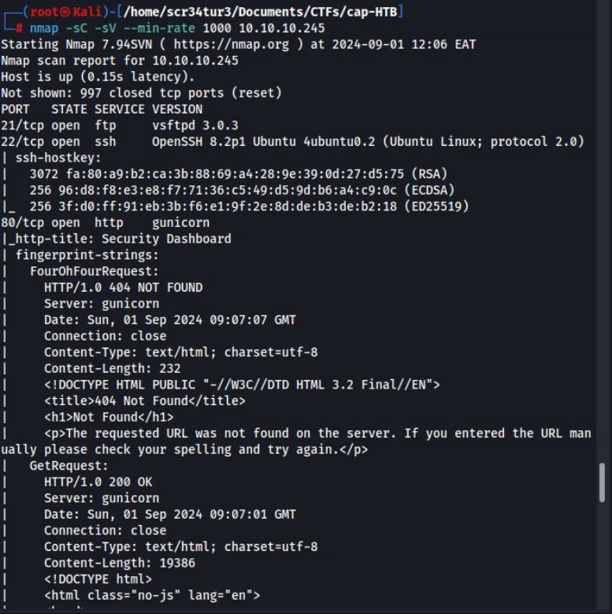

2/15 

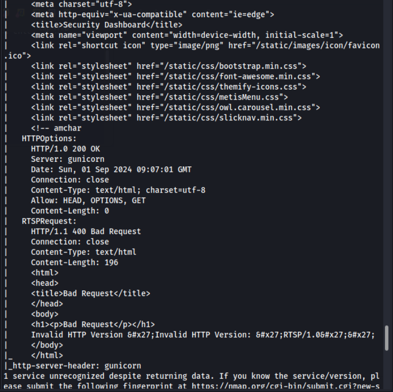

As its seen above, port 21=ftp, port 22=ssh, port 80=http were open and running on the target machine. Trying to connect to the target via ftp service via anonymous login failed. Seems anon login is not allowed. 

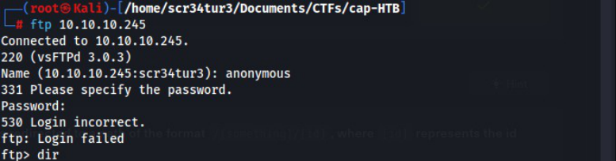

3/15 

I now checked what was running on port 80 via my browser. It looked like a security monitoring dashboard, anyway let's find out. 

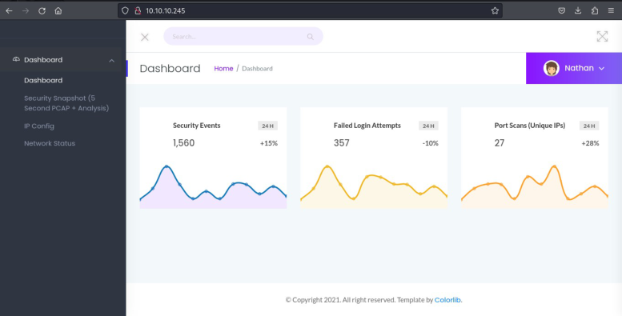

Using gobuster, I fuzzed for hidden directories as seen below. Found interesting directories that I went ahead to look them out. 

4/15 

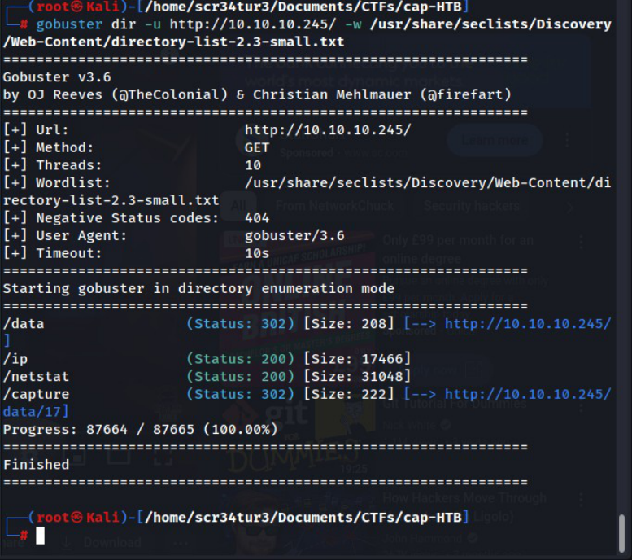

This was what I found under ip directory. 

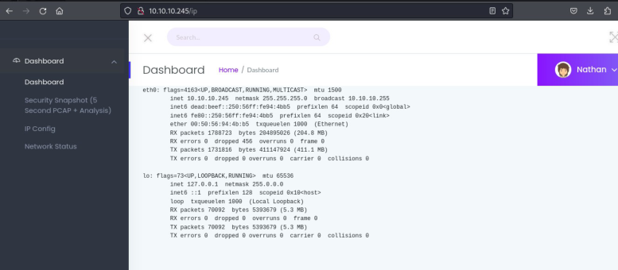

5/15 

This was what was under nestat directory. It displayed network connections, routing tables, interface statistics, masquerade connections, and multicast memberships. It is commonly used for network troubleshooting and monitoring. 

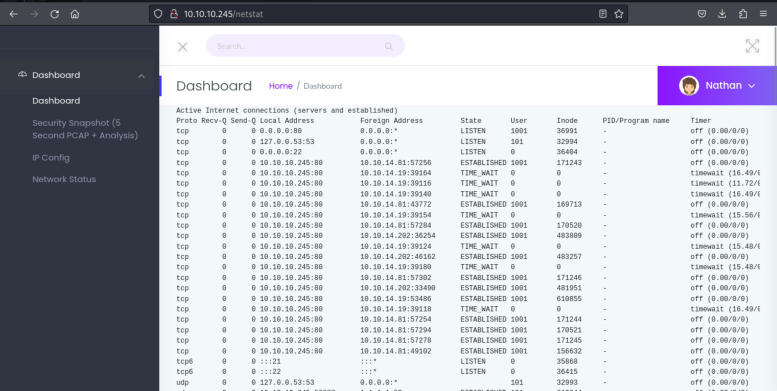

From the begining, I did not notice there was this user called Nathan with whom we were logged in as. Initially from the gobuster output, there was this file “.../data/17” that I saw. following that path url, I was presented with a page that contained .pcap files that could be downloaded. I decided to play around with the numbers and checked out 0. 

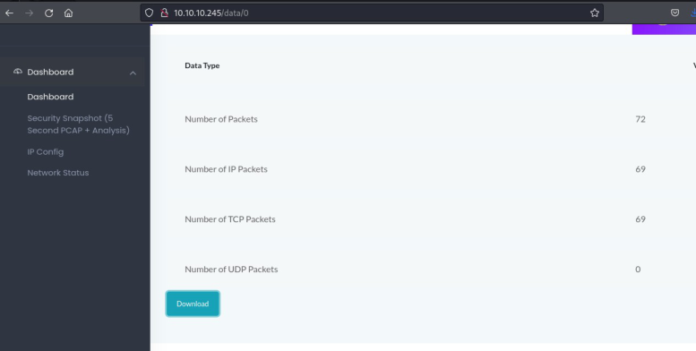

I downloaded the file and anylised it using wireshark as seen below. 

6/15 

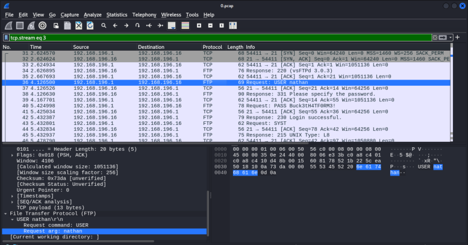

I noticed under ftp protocol, there was an attempt of a login as user nathan. Following this tcp stream, I found the plain-text creds of user nathan. This is so critical since the password was exposed eventhough seemed to be a strong password. 

7/15 

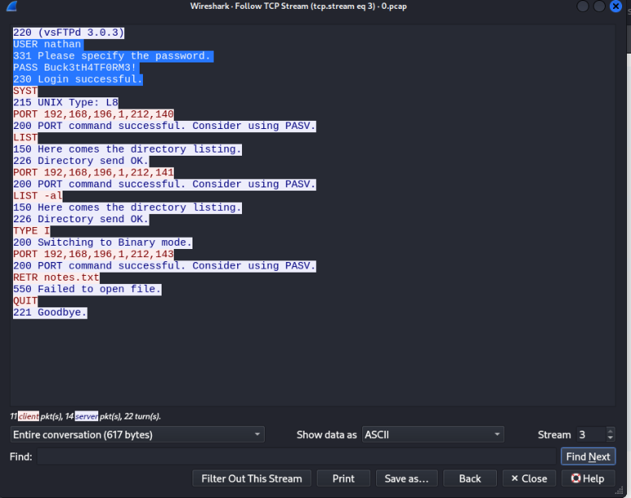

I successfully connected to the ftp service using this credentials as seen below. 

8/15 

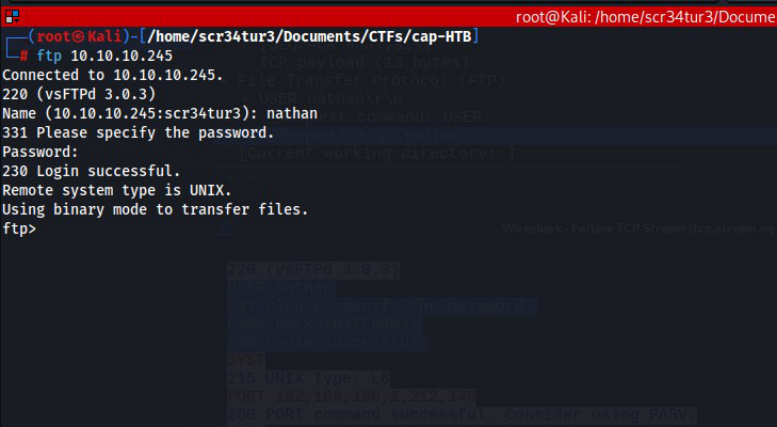

From this point I can download any file to my local machine and view its content. 

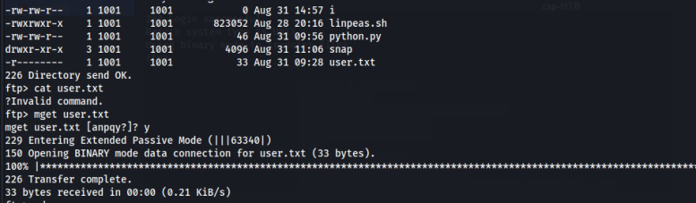

I downloaded the user flag and read its content as seen below. 

9/15 

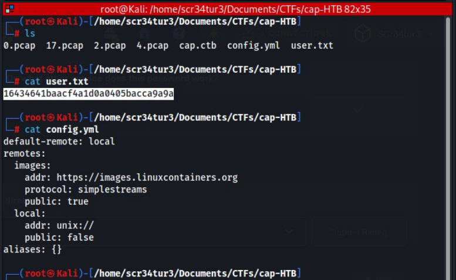

Using nathan's creds, I successfully logged into the target machine. 

10/15 

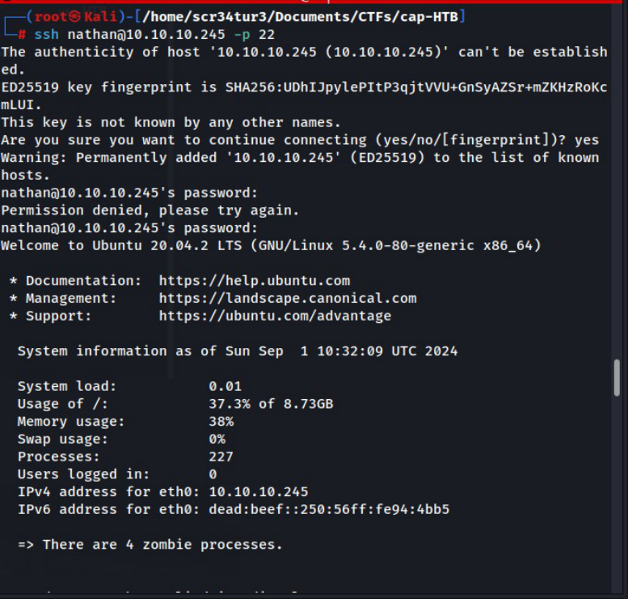

11/15 

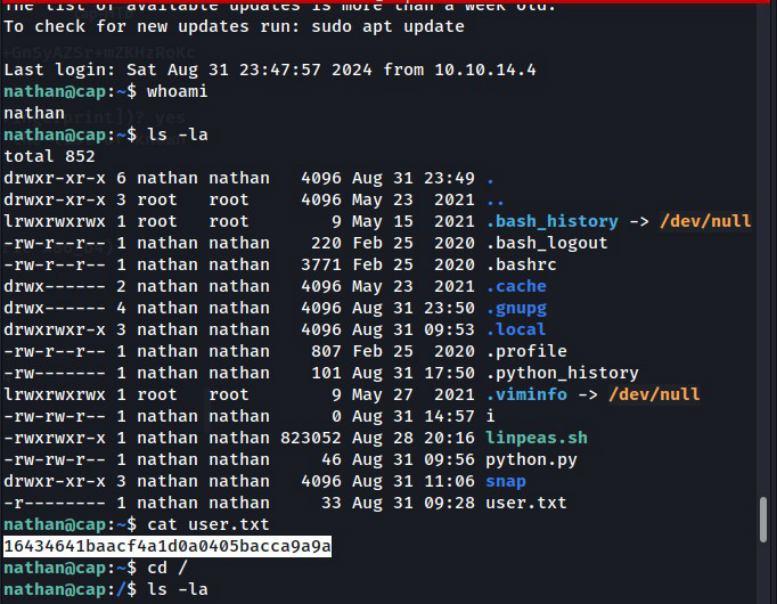

I tried to look around for any misconfigurations, outdated-softwares, if this user can run sudo on this target machine, and SUID bit set. 

Fortunately for me, I found a python binary with capabilities set. If there is misconfiguration, then we can abuse it to spawn a root shell. 

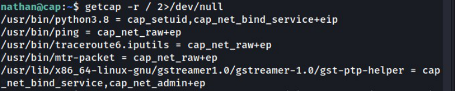

I visited my great ally <u>gtfobins.io to find me a suitable payload that could help me break out of this restricted shell.</u> 

12/15 

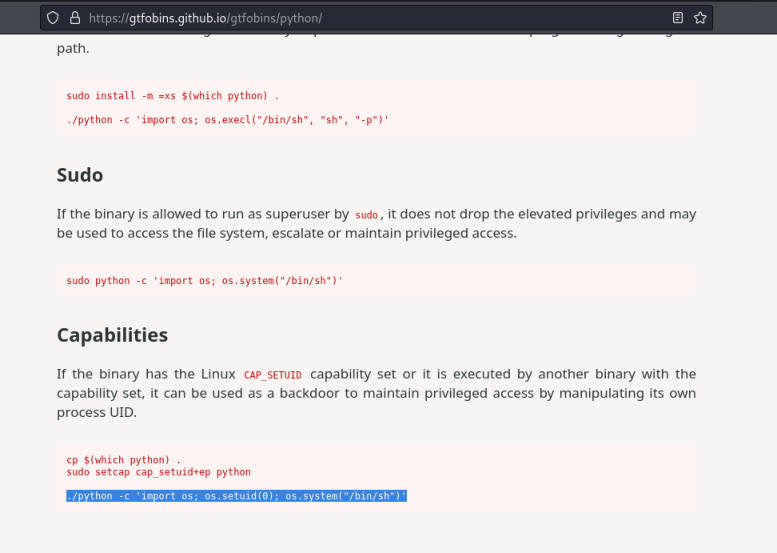

Using the payload, I successfully spawned a root shell as seen below. I now was able to retrieve the root flag. 

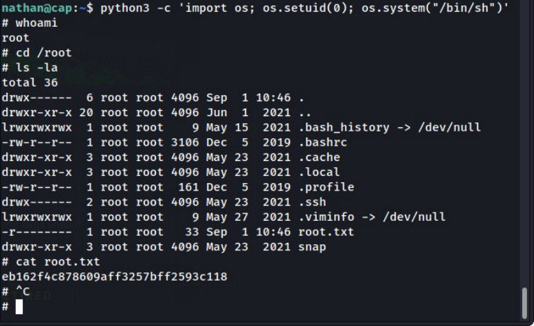

13/15 

<u>https://www.hackthebox.com/achievement/machine/1944033/351</u> 

## **Conclusion** 

The penetration test successfully demonstrated several critical security vulnerabilities within the target HTB machine. Key findings include: 

1. **Credential Exposure:** The analysis of captured network traffic revealed plaintext credentials, which were used to gain initial SSH access to the machine. This highlights the importance of encrypting sensitive data in transit to prevent unauthorized access. 

2. **Privilege Escalation:** A misconfiguration in binary capabilities was identified, allowing for privilege escalation from a standard user to root. This finding underscores the necessity of careful management of system permissions and configurations to prevent unauthorized privilege escalation. 

3. **System Security Implications:** The vulnerabilities identified pose significant risks if left unaddressed. Proper security measures, including network traffic encryption and rigorous system configuration reviews, are essential to safeguarding systems against similar attacks. 

The insights gained from this engagement emphasize the importance of a multi-faceted approach to cybersecurity. Regular assessments and proactive measures are crucial in maintaining robust defenses against potential threats. This report serves as a reminder that even small oversights can lead to substantial security risks. Addressing these vulnerabilities promptly is essential in ensuring the integrity and security of information systems. 

14/15 

15/15
