> Writeup · part of **[htb-walkthroughs](../README.md)** · [⬇ original PDF](Conversor.pdf)

---

# **<u>CONVERSER SEASON 9 - HACKTHEBOX</u>** 

## **<u>RATE: Easy</u>** 

#### **1. RECONNAISSANCE** 

Nmap scan output. 

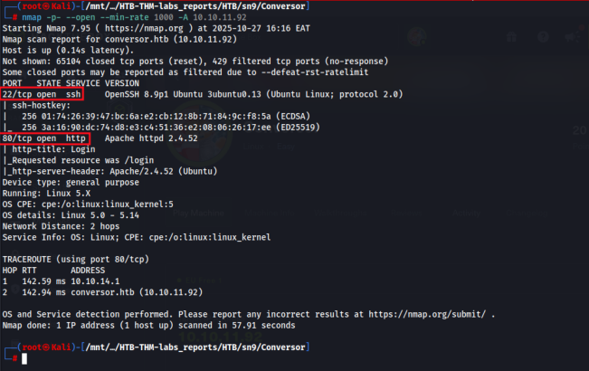

add _conversor.htb_ to /etc/hosts 

Wappalyzer reveals the target is running on apache server and its a linux system. 

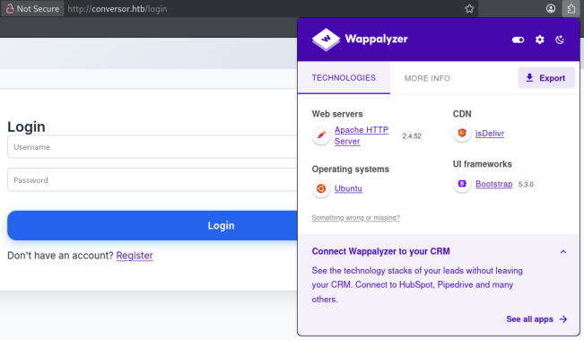

On port 80 we get to see an upload functionality that we can test for bypass and exploitation. 

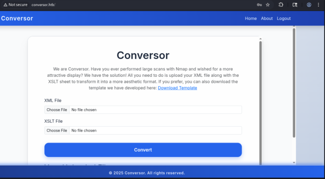

``` 

### **What “Conversor” does** 

“Conversor” appears to be a **converter** that: 

1. Takes your **Nmap XML output** ( scan.xml ), and 

2. Applies an **XSLT stylesheet** ( .xslt file), 

3. Produces an **HTML page** with a cleaner, more aesthetic display of your scan results. 

``` 

Endpoint Discovery: 

Fuzzing for endpoints using ffuf. /about and /converter are revealed. 

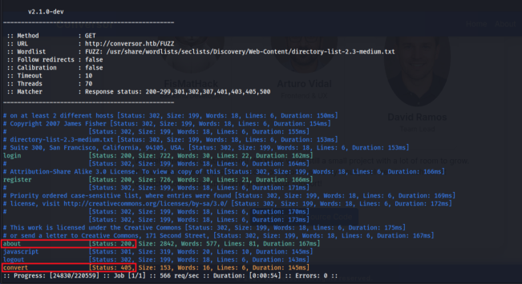

Source Code Disclosure. /about endpoint reveals a critical vulnerability(source code disclosure). 

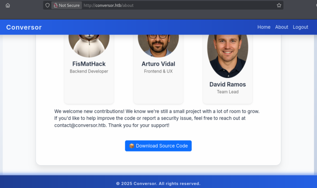

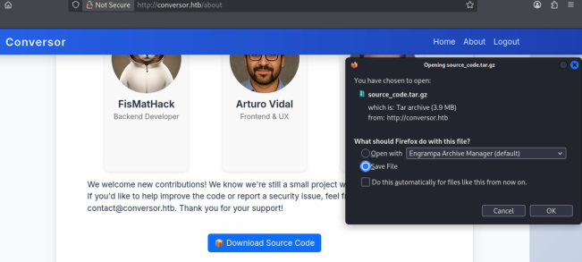

Interestingly, as shown in the source code install.md below, so if we find a way to upload to the script, we can get a shell. 

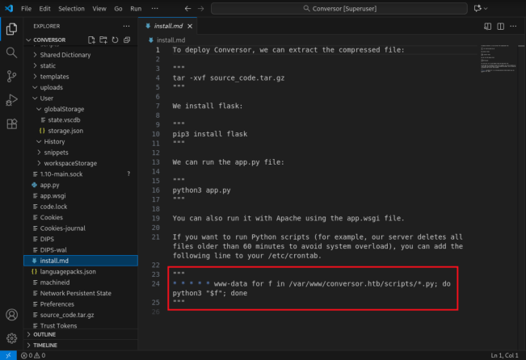

Create shell.sh and open python http server. <u>shell.sh -> reverse shell payload.</u> 

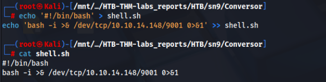

This is the Python script our XSLT will create on the victim. It’s a simple “stager” that downloads and executes shell.sh . 

<u>shell.py -></u> 

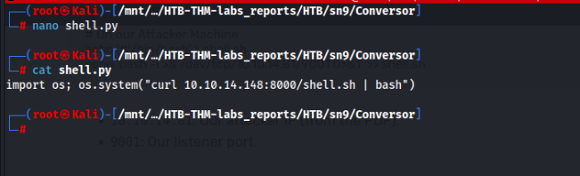

#### Shell.xslt 

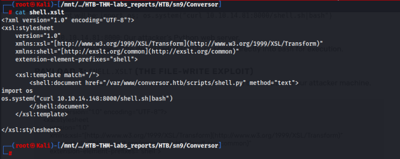

Upload successfully. After uploading nmap.xml and shell.xslt, access youUploadfile.html. We open the listener and wait for cron to execute (every 60 seconds) and then get the shell. 

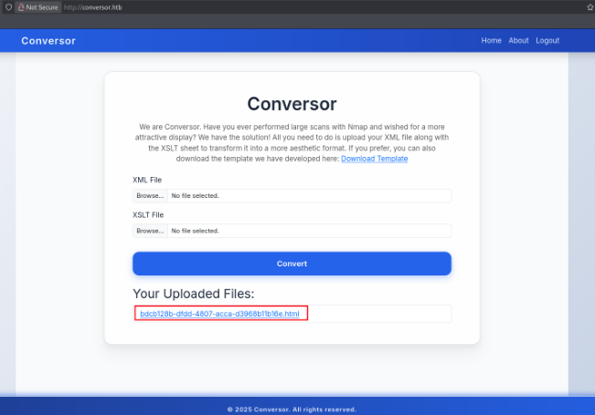

Fetch the shell.py on our machine. 

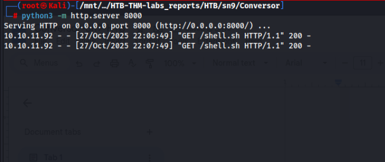

Got the reverse shell. 

/mnt/../HTB-THM-labs_reports/HTB/sn9/Conversor c 9001 bash: cannot set terminal process group (79612): Inappropriate ioctl for device bash: no job control in this shell bash-5.1$ whoami whoami wwwi-data bash-5.1$ pwd pwd /var/wuw bash-5.1$ which python which python bash-5.1$ 

<u>users.db</u> The source code (and PDF) tell us the database is in the instance folder. 

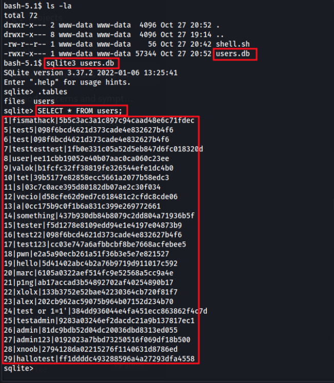

These are MD5, so we crack them using crackstaion and we get the credentials. **fismathack:Keepmesafeandwarm** 

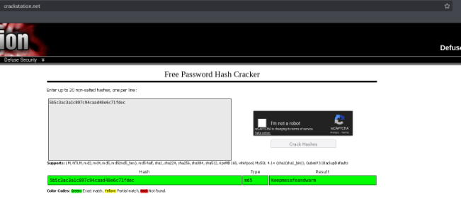

We can now ssh into the target machine as user **fismathack** 

/mnt/../HTB-THM-Labs_reports/HTB/sn9/Conversor fismathackaconversor.htb The authenticity of host ‘conversor.htb (10.10.11.92)' can't be established. £D25519 key fingerprint is SHA256:xCQVSIWulxtwatNjsFrwT7VS83ttILDqpHrLnXiHR8. This key is not known by any other names. ‘Are you sure you want to continue connecting (yes/no/[fingerprint])? yes Warning: Permanently added ‘conversor.htb' (£D25519) to the List of known hosts. fismathack@conversor.htb's password: Welcome to Ubuntu 22.04.5 LTS (GNU/Linux 5.15.0-160-generic x86_64) * Documentation: https://help.ubuntu.com * Management: https: //Landscape.canonical.com * Support: https: //ubuntu.com/pro System information as of Mon Oct 27 08:58:47 PM UTC 2025 System load: 0.03 Processes: 305 Usage of /: 73.4% of 5.78GB Users logged in: 1 Memory usage: 24% IPv4 address for ethO: 10.10.11.92 Swap usage: 0% * Strictly confined Kubernetes makes edge and IoT secure. Learn how Microk8s just raised the bar for easy, resilient and secure k8s cluster deployment. 

https: //ubuntu.<sup>com/engage/secure-kubernetes-at-the-edge</sup> 

Expanded Security Maintenance for Applications is not enabled. 

© updates can be applied immediately. 

Enable ESM Apps to receive additional future security updates. See https://ubuntu.com/esm or run: sudo pro status 

Failed to connect to https://changelogs.ubuntu.com/meta-release-lts. Check your Internet connection or proxy settings 

The programs included with the Ubuntu system are free software; the exact distribution terms for each program are described in the individual files in /usr/share/doc/*/copyright. 

Ubuntu comes with ABSOLUTELY NO WARRANTY, to the extent permitted by applicable law. -bash-5.1$ whoami fismathack -bash-5.1$ 

## **<u>USER FLAG</u>** 

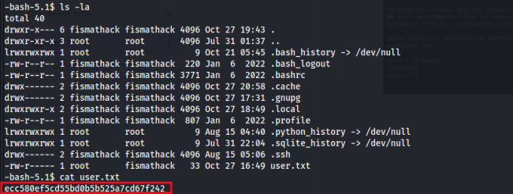

Our first command as a new user should _always_ be sudo -l . 

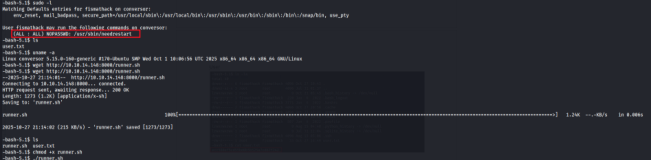

the needrestart version is old. 

``` 

fismathack@conversor:~$ sudo /usr/sbin/needrestart -v 

[main] eval /etc/needrestart/needrestart.conf 

[main] needrestart v3.7 

[main] running in root mode 

...snip... ``` 

## **ROOT** 

So it is possible to use <u>CVE-2024–48990</u> to get a shell, but the target does not have gcc, so we need to build lib.c on our machine and compile it with gcc. 

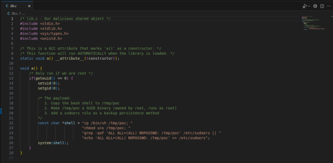

Then we modify runner.sh, remove the lib.c part, and change gcc to curl, the __init__.so we just compiled 

Host a python server on our machine locally, get the runner.sh file, make it executable using chmod +x and the execute the file…. 

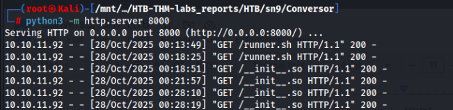

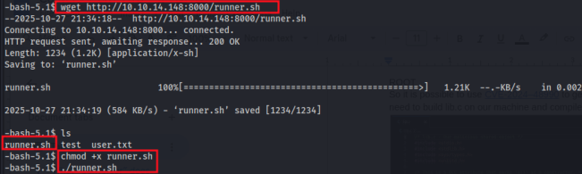

After executing runner.sh, we need to open another ssh window and execute _sudo /usr/sbin/needrestart_ to obtain the root shell. 

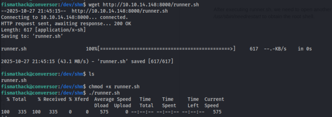

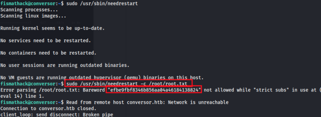
