> Writeup · part of **[htb-walkthroughs](../README.md)** · [⬇ original PDF](Nmap.pdf)

---

# **NETWORKING** 

INTRODUCTION: 

Enumeration is the process simply put of, finding as many ways as possible to attack a particular machine/network. Consequently, I want to work on the breadth of my enumeration and exhausting all possible attack vectors. Ultimately in pentesting you are trying to find all possible vulnerabilities in a network, not just one. 

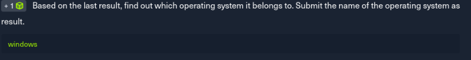

TTL can help us determine the operating system, and by default, window OS = 128 

linux OS = 64 

mac OS = 64 

Having this knowledge, I managed to determine the OS as windows. 

I ran an nmap scan of all the ports, and here was the output as shown below. 

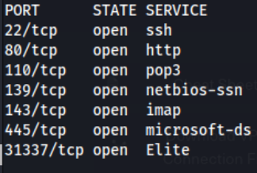

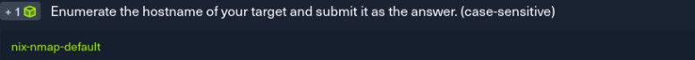

To enumerate the hostname, I ran a nmap script for hostname discovery just as shown in the image below. 

1/8 

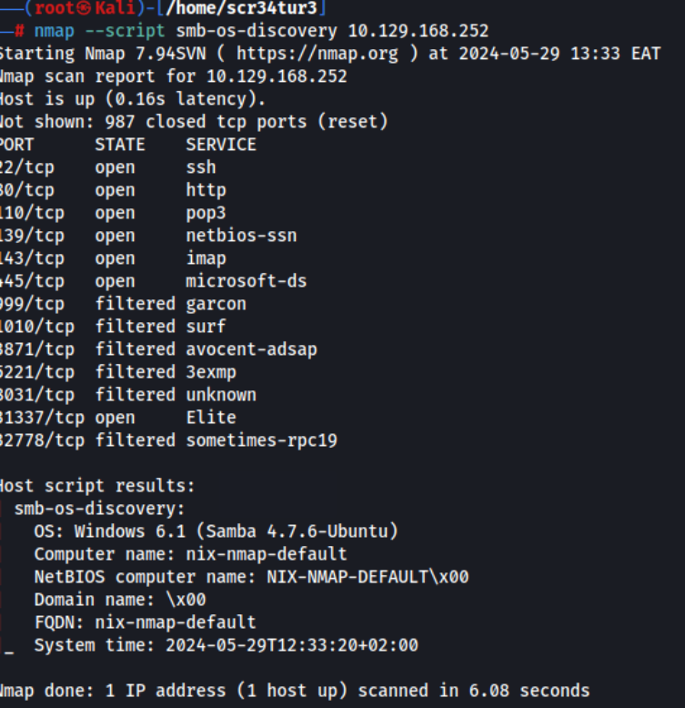

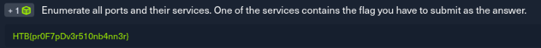

2/8 

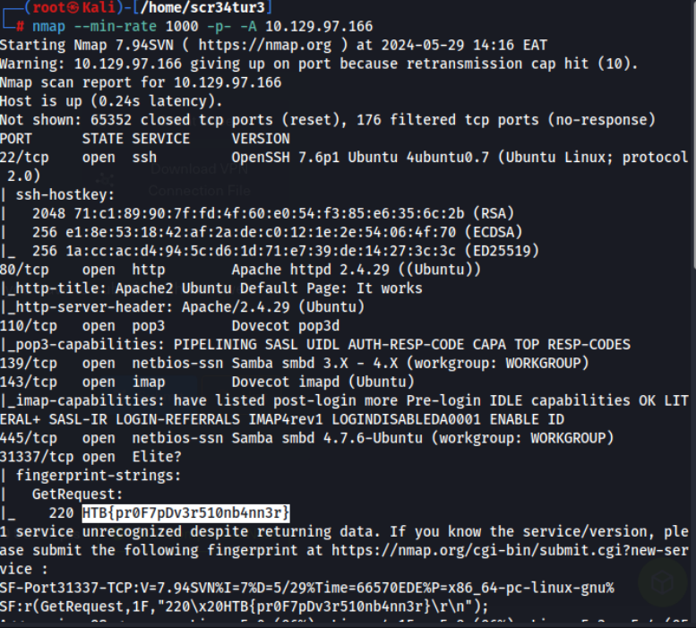

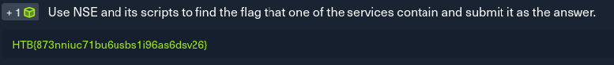

Running an nmap script to enumerate port 80, I found a directory /robots.txt just as shown below. 

3/8 

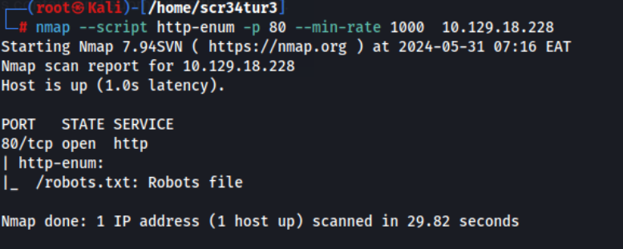

visiting that path url I find this flag. 

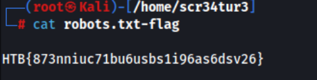

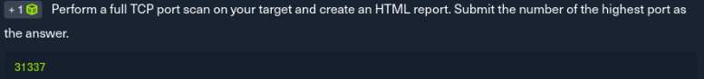

From my initial nmap scan to find all tcp ports on the target, I found port 31337 to be the highest port. 

4/8 

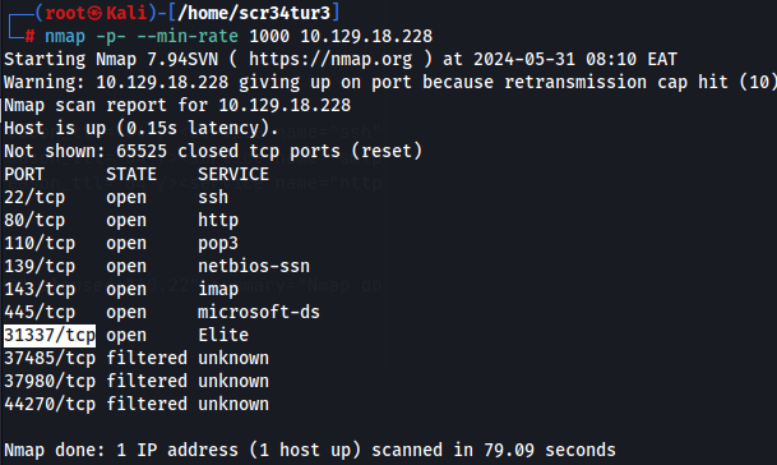

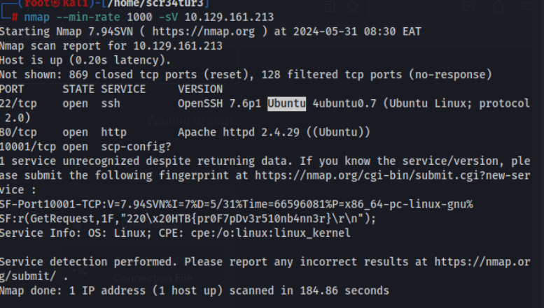

5/8 

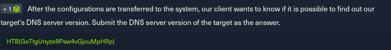

So I decided to use a different approach to find this flag. Instead of running an nmap scan, I used dig to dig for dns server version just as shown in the image below. 

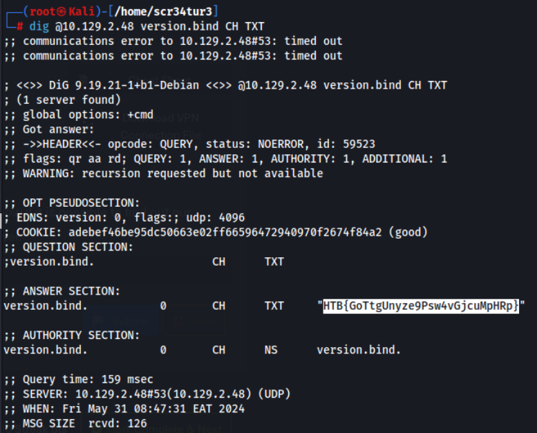

This task hinted at large amounts of data and so a full port scan (-p-) reveals port 50000. Above we set up a netcat listener between DNS port 53 and this new mysterious port 50000. Let the netcat listener run for a second or two and the flag presents itself with a successful 220 request. 

6/8 

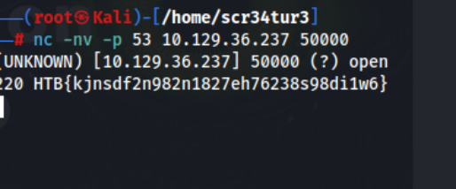

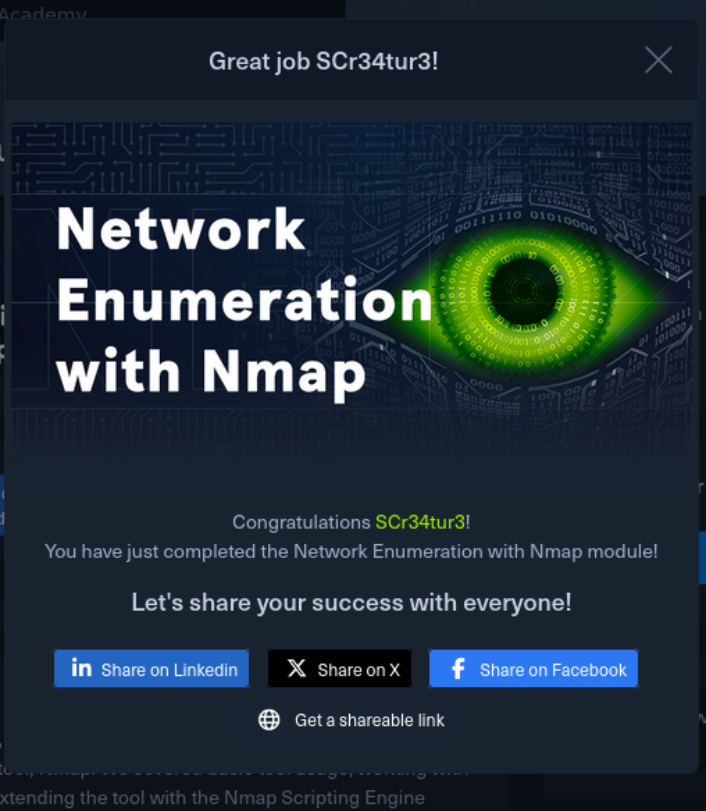

7/8 

<u>https://academy.hackthebox.com/achievement/1287818/19</u> 

## CONCLUSION 

This module required a lot of outside research, but I feel it’s part of the job. It’s not a memory of everything game, but knowing where to look for the tool you need to do the job you want. 

8/8
