> Writeup · part of **[htb-walkthroughs](../README.md)** · [⬇ original PDF](Permx.pdf)

---

# **permx-seasonal-machine** 

INTRODUCTION 

This notes shows my methodology and approach on tackling this machine. Let's get started. 

Given the target, I scanned for open ports and services using nmap. 

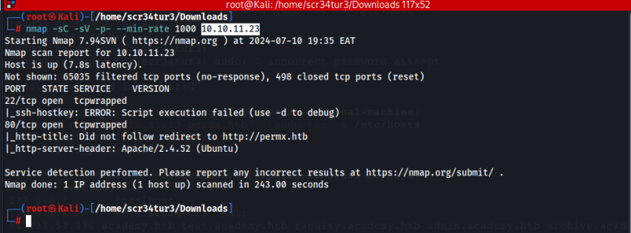

port 22 running ssh service is open port 80 running a web application is open 

Openning this web application on my browser, it can't be reached since it cannot be resolved. I added this target in  my /etc/hosts file as seen below. 

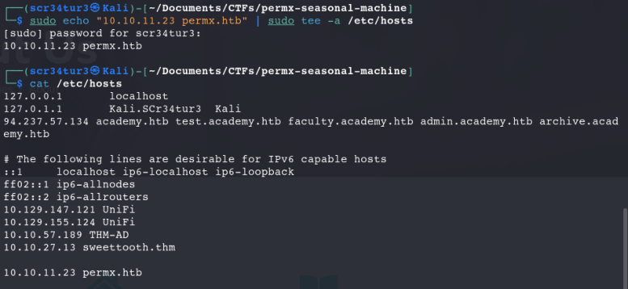

Accessing the target via web browser, its accessible as below. Its an elearning platform. 

1/10 

I fuzzed for vHOSTS as below, I found lms subdomain. I also fuzzed for hidden dir but there was nothing of much interest. 

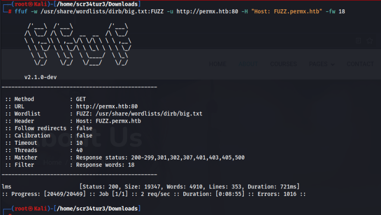

I first added the lms.permx.htb in my /etc/hosts file and accessed it via a web browser. Looking for recent exploits for the Chamilo application, I came across the GitHub below, which shows a POC to gain unauthenticated reverse code execution. <u>https://github.com/Ziad-Sakr/Chamilo-LMS-CVE-2023-4220-Exploit/ blob/main/CVE-2023-4220.sh?source=post_page-----84871140b508--------------------------------</u> 

2/10 

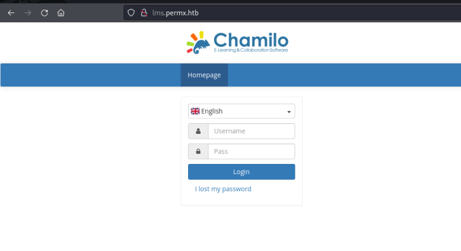

I tried to automate for sql injection using sqlmap, but the target wasn't vulnerable to injections. 

3/10 

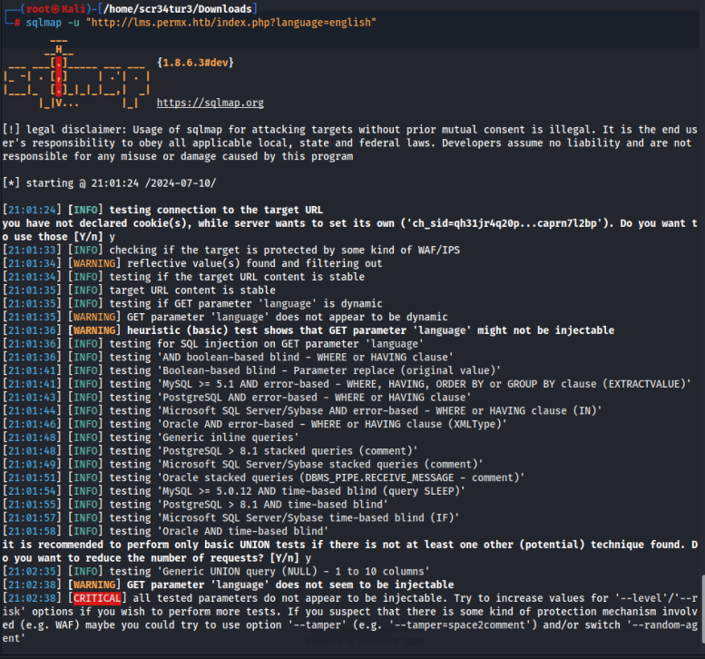

I did a google search for chamilo exploit, and found one script on github that served my interest in this case as shown below. Use the below PHP reverse shell to get a reverse shell with the above POC.(modify the IP address to the IP address of your attack host) <u>https://raw.githubusercontent.com/pentestmonkey/php-reverse-shell/master/phpreverse-shell.php</u> 

4/10 

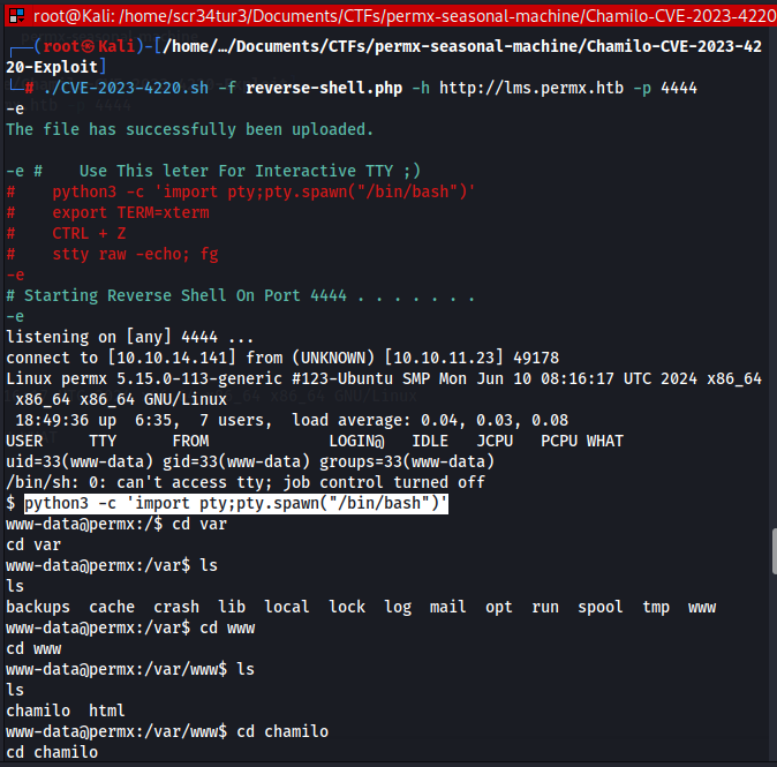

-f was to specify the file that was going to give us back a shell. -h specified the host target and -p specified the listening port. All this must be configured correctly in the reverse shell file. From the above image, I gained the reverse shell. 

Using linpeas.sh script(which I did not manage to dowload to the target machine due to permission issues) I was able to retrieve some creds on the /var/www/chamilo/app/config/configuration.php file as seen below. There was also a user mtz in the home dir, 

5/10 

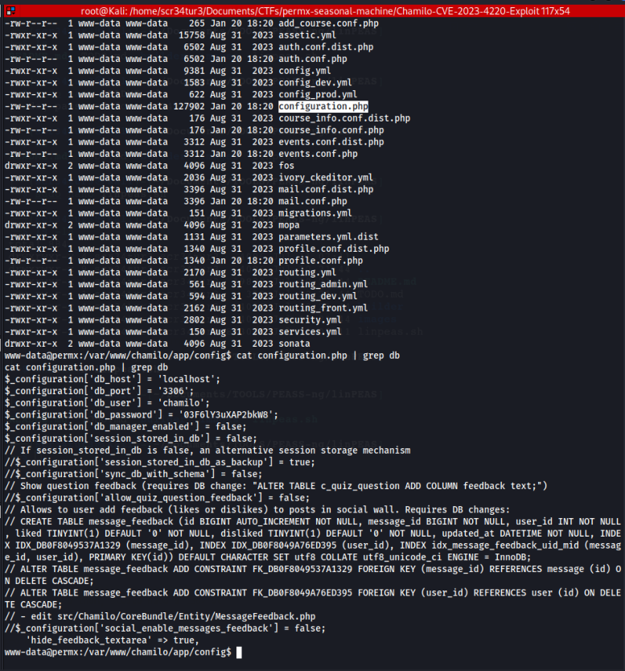

With knowledge, I sshed to the target using this creds. 

6/10 

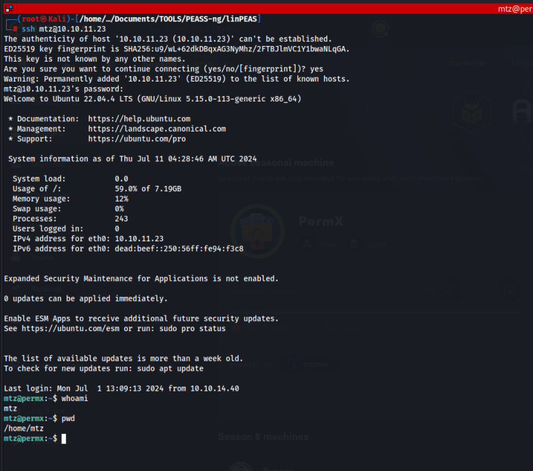

As seen below, I was able to retrieve the user.txt flag. 

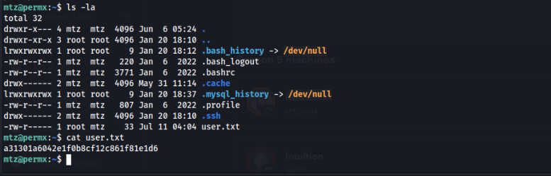

I found out that this user can run a custom script ‘/opt/acl.sh’ as root as seen below. 

7/10 

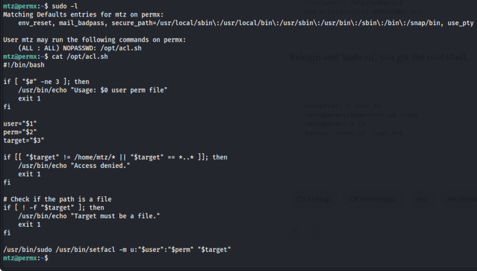

Used this script to change the permissions on the sudoers file and modified it togive the mtz user sudo privileges on the host. To achieve this, I created a symbolic link to the/etc/sudoers file on /home/mtz directory and used the script to give read/write permissions to the user as seen below. 

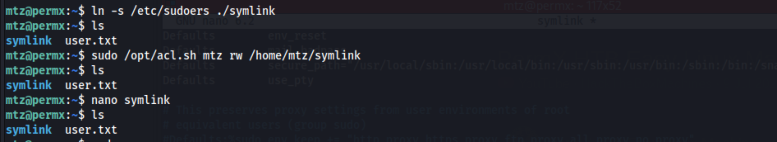

Modified the the sudoers file as below via the symlink script file I had created prior. 

8/10 

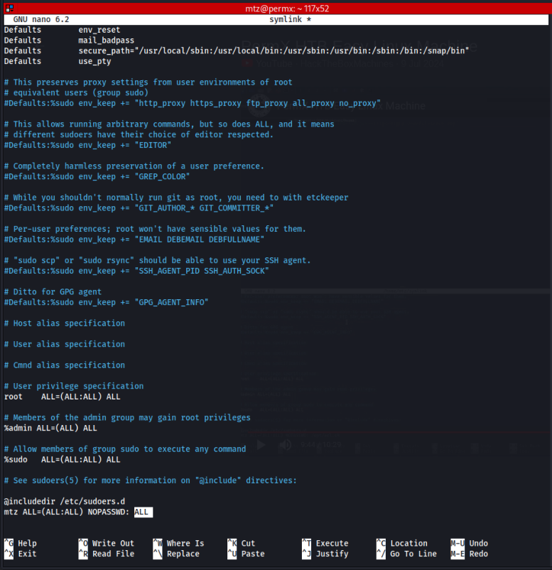

I  ‘sudo su’, you got the root shell as below. 

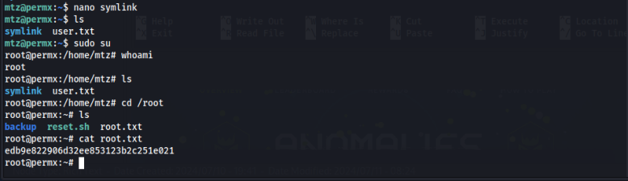

9/10 

<u>https://www.hackthebox.com/achievement/machine/1944033/613</u> 

## CONCLUSION 

This was a fascinating machine that tested my skill on privilege esc majorly. Though It required a lot of internet research. 

10/10
