> Writeup · part of **[htb-walkthroughs](../README.md)** · [⬇ original PDF](Soupedecode01.pdf)

---

# **<u>SOUPEDECODE 01 - TRYHACKME</u>** 

I started with a Nmap scan, which revealed multiple services typical of an Active Directory environment, including DNS (53), **Kerberos** (88, 464), **SMB** (445), **LDAP** (389, 636), Global Catalog services (3268, 3269), and MSRPC/NetBIOS (135, 139). Additional services such as Remote Desktop Protocol (3389), Active Directory Web Services (9389) 

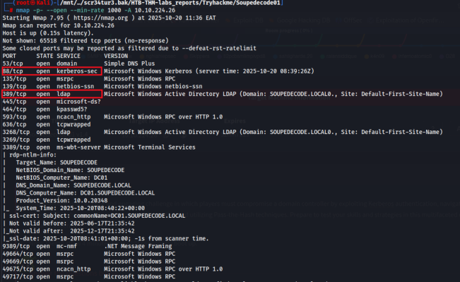

I had access to smb as guest where I was able to enumerate shares 

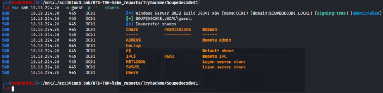

<u>#https://www.hackingarticles.in/as-rep-roasting/ #https://www.hackingarticles.in/ad-recon-kerberos-username-bruteforce/</u> 

## **RID-based enumeration** 

To further enumerate domain users, I performed a RID brute-force, since the IPC$ share is readable. 

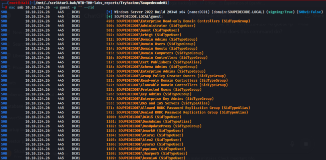

### Bruteforcing for valid accounts, I found one ybob317 

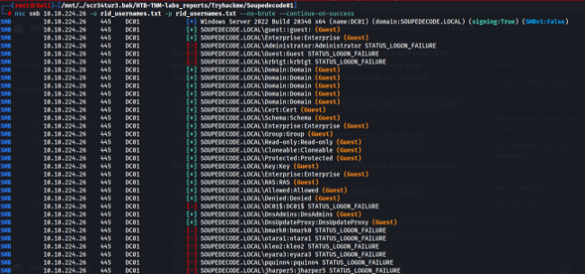

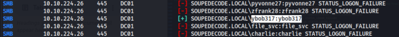

### Share Enumeration with this account. 

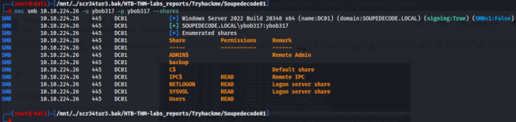

I connected to the Users shares since user ybob317 had read permission on this share. 

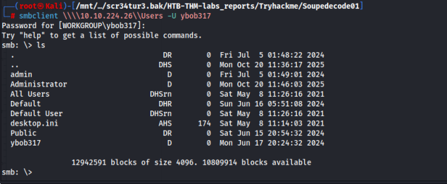

## **USER FLAG** 

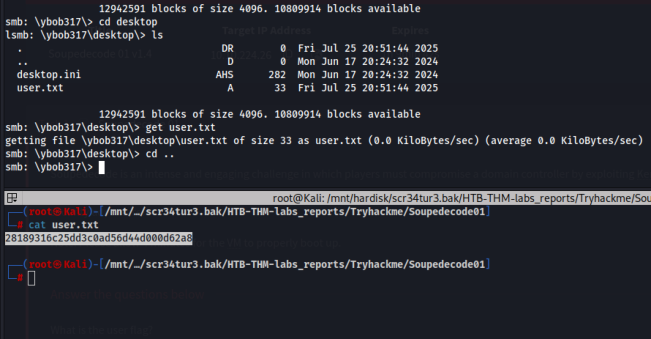

## **Kerberoast Attack** 

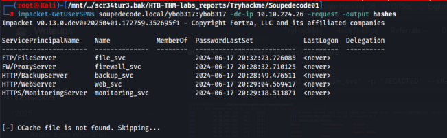

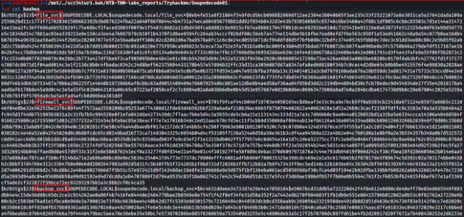

### Cracked hash using hashcat → **file_svc:Password123!!** 

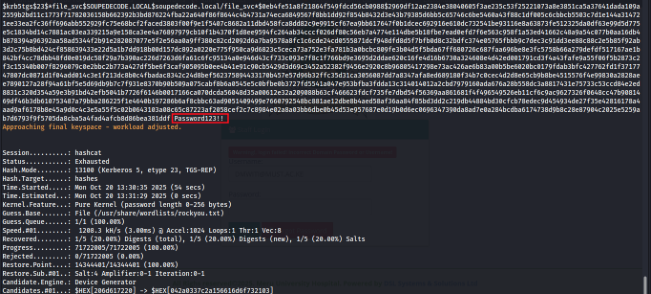

We have read permission on backup shares. The backup share had backed up account credentials. 

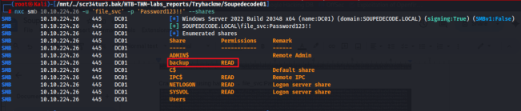

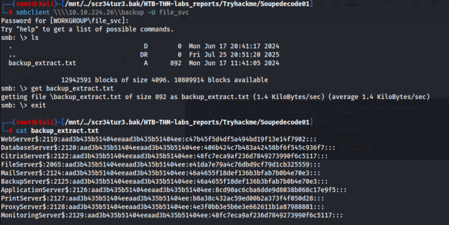

## **Password Spraying** 

Sprayed the passwords and found one active account, which turned out to be/have domain admin privileges. 

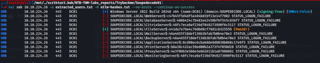

This confirms this domain admin 

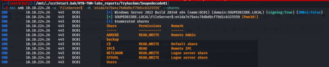

## **ROOT FLAG** 

I accessed the machine viar RDP and got the root flag. 

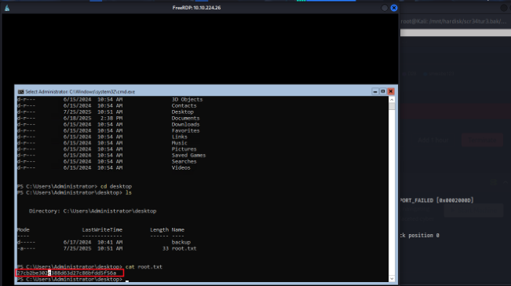
