> Writeup · part of **[htb-walkthroughs](../README.md)** · [⬇ original PDF](Tombwatcher.pdf)

---

# **<u>TOMBWATCHER SEASON 8 - HACKTHEBOX</u>** 

### Initial credentials: **henry || H3nry_987TGV!** 

Nmap output: Port **88 kerberos** and **389 ldap** are open signaling we are attacking a Domain Controller. 

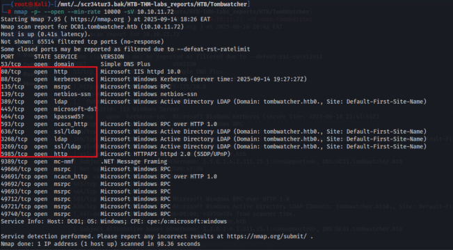

## **PORT 445(SMB SHARES ENUMERATION)** 

Nothing much can be done or extracted from the shares. 

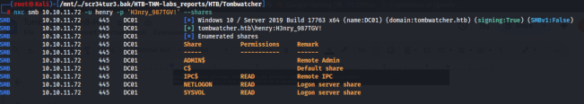

## **LDAP DOMAIN DUMP ENUMERATION** 

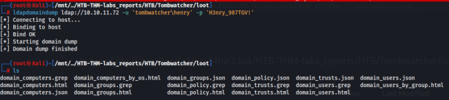

## **BLOODHOUND DUMP OUTPUT Exploitation:** 

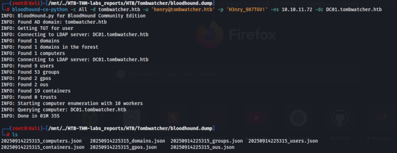

### User Henry has **writeSPN** permission over user Alfred 

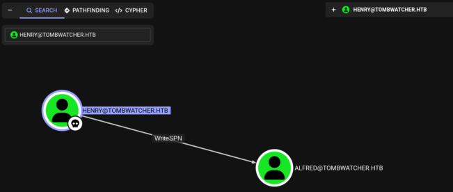

### Using a tool called 

**targetedkerberoast.py** <u>(https://github.com/Shadrack2023/targetedKerberoast/blob/main/targeted Kerberoast.py) we are able to retrieve the krb hash for user</u> **Alfred** . 

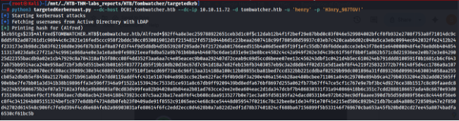

### Cracked the hash using john → cleartext password **alfred:basketball** 

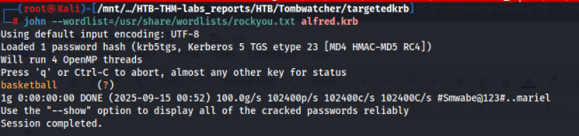

### Using nxc we confirm that the credentials are working. 

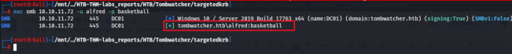

## **LATERAL MOVEMENT** 

### User alfred can addself to group INFRASTRACTURE 

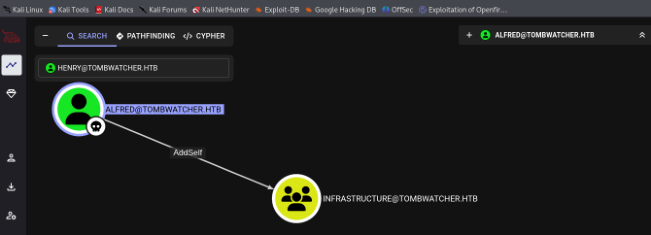

### Using **bloodyAD tool** , we can add user alfred to the **INFRASTRUCTURE** GROUP 

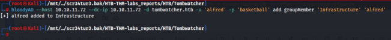

The image below confirms our user is added to the infrastructure group. 

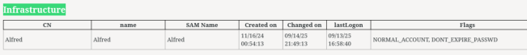

We’ll use NetExec to enumerate **Group Managed Service Accounts (gMSAs)** from Active Directory, retrieving their **account names** , **Kerberos keys** (plaintext or hashes), and related metadata if permissions allow. 

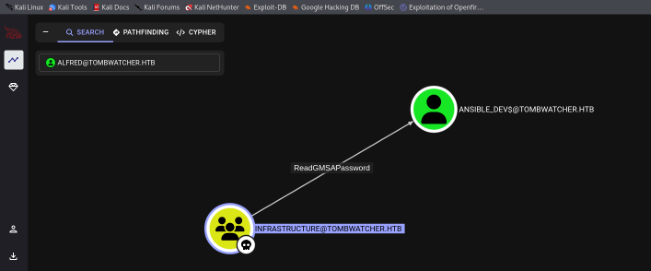

Using nxc, we are able to retrieve a machine account’s hash 

**ansible_dev$:4f46405647993c7d4e1dc1c25dd6ecf4** Wap 10.10,11.72Zs-/sc834tur3bak/HTB-T-Labs_reports/HTB/Tonbuat-0 alfred cher si **o** riovilie **t** .72i7 389" ocot Windows 10 / Server 2019 Build 17763 

These credentials are working. Confirmed this using nxc 

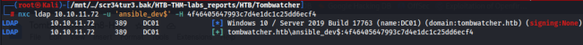

With this machine account credentials, we can force user “ **sam** ” to change password and authenticate using **sam’s** credentials 

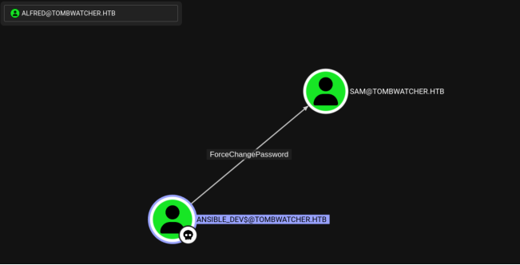

Using the **net rpc tool** , we managed to change password for user sam and confirmed authentication using nxc as in the image below. 

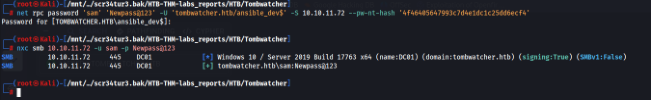

## **SAM TO JOHN** 

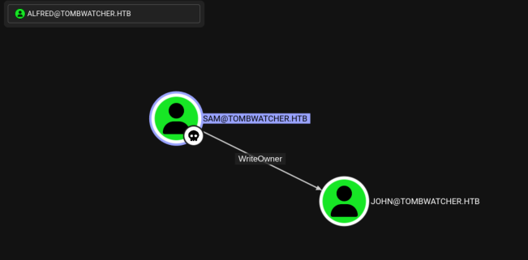

``` 

To change the ownership of the object, you may use Impacket's **owneredit** example script (cf. "grant ownership" reference for the exact link). 

owneredit.py -action write -owner 'attacker' -target 'victim' 'DOMAIN'/'USER':'PASSWORD' 

To abuse ownership of a user object, you may grant yourself the GenericAll permission. 

Impacket's **dacledit** can be used for that purpose (cf. "grant rights" reference for the link). 

dacledit.py -action 'write' -rights 'FullControl' -principal 'controlledUser' -target 'targetUser' 'domain'/'controlledUser':'password' 

``` 

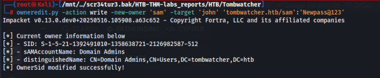

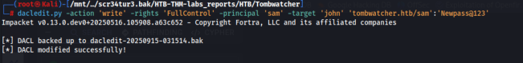

Having **FullControl** rights on user john, we can now change his password using the net  rpc tools and authenticate to the target via winrm. 

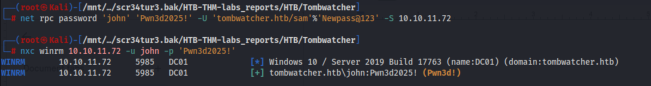

## **USER FLAG** 

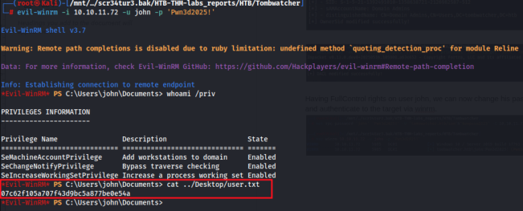

## **PRIVILEGE ESCALATION TO ROOT** 

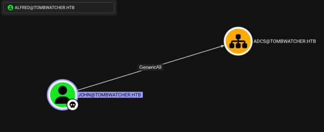

### The ADCS service is enabled 

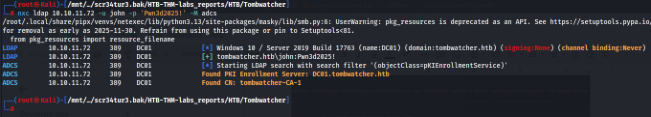

### Enumerated the ADCS to find vulnerable templates using the **certify** tool. 

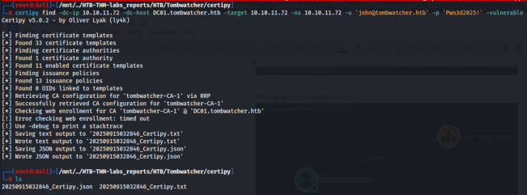

No misconfigured templates for this user, let's dig a further. 

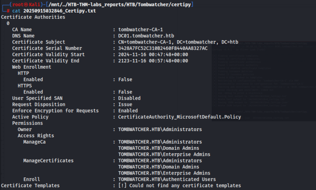

Found deleted objects ` Get-ADObject -Filter {isDeleted -eq $true} -IncludeDeletedObjects -Properties * | Select-Object Name,ObjectGUID` 

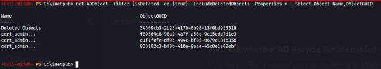

We managed to restore the deleted object as seen below `Restore-ADObject -Identity c1f1f0fe-df9c-494c-bf05-0679e181b358` `Get-ADUser -Identity 'cert_admin' | Format-List Name,DistinguishedName,Enabled` → checks if the object is restored. 

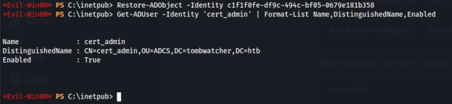

John has **GenericAll rights** on ADCS group which by speculation user **cert_admin** belong to. We’ll now abuse these rights. 

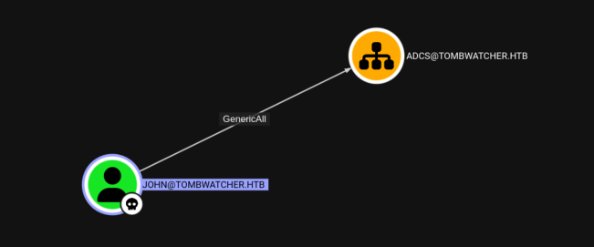

Perfect, now we have user cert_admin. Lets find misconfigured templates with this user. 

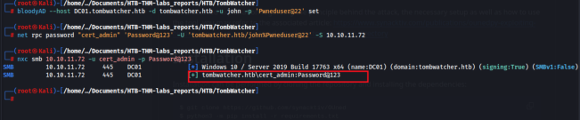

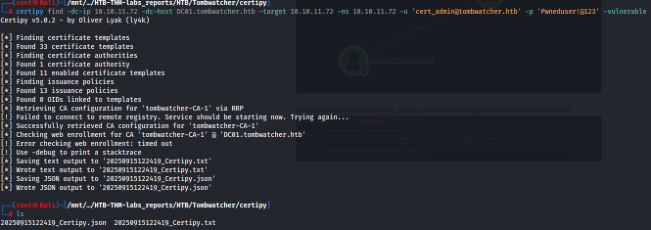

### Found a misconfigured cert template **ESC15** 

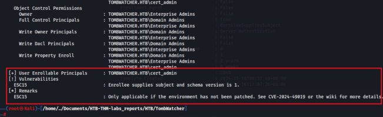

We can now request cert template using certipy 

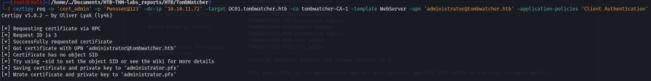

Then authenticate as user administrator 

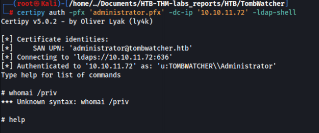

Right in the shell, we are able to change administrator’s password as seen below, which can then be used for authentication 

enabteraceount-user'=-enabte the User"s account dump = Dumps ‘the domain. 

## **ROOT FLAG** 

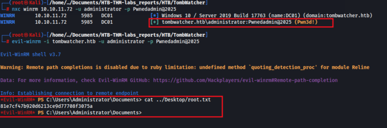
